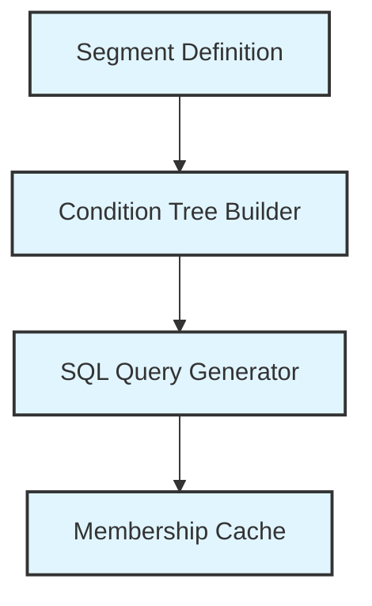

# Customer Segments - Developer Guide <span class="version-badge">v25.9+</span>

This guide covers the technical implementation of Maho's Customer Segmentation system, including architecture, database schema, condition types, code examples, and extension points.

## Architecture Overview

Customer Segments in Maho use a rule-based condition system that generates optimized SQL queries for matching customers against complex criteria.

<div align="center">



</div>

**Flow**:

1. **Segment Definition** - Conditions, rules, and configuration
2. **Condition Tree Builder** - Nested AND/OR logic structure
3. **SQL Query Generator** - Optimized SELECT statements
4. **Membership Cache** - Materialized in `customer_segment_customer` table

### Key Components

| Component | Location | Purpose |
|-----------|----------|---------|
| **Segment Model** | `Maho_CustomerSegmentation_Model_Segment` | Core segment logic and orchestration |
| **Condition Base** | `Maho_CustomerSegmentation_Model_Segment_Condition_Abstract` | Base class for all condition types |
| **Condition Combine** | `Maho_CustomerSegmentation_Model_Segment_Condition_Combine` | Logical AND/OR/NOT combinations |
| **Condition Types** | `Maho_CustomerSegmentation_Model_Segment_Condition_*` | 11 specialized condition implementations |
| **Resource Model** | `Maho_CustomerSegmentation_Model_Resource_Segment` | Database operations and SQL generation |
| **Cron Model** | `Maho_CustomerSegmentation_Model_Cron` | Scheduled segment refresh |

## Database Schema

### customer_segment

Primary segment configuration table:

```sql
CREATE TABLE customer_segment (
    segment_id INT UNSIGNED PRIMARY KEY AUTO_INCREMENT,
    name VARCHAR(255) NOT NULL,
    description TEXT,
    is_active SMALLINT UNSIGNED NOT NULL DEFAULT 1,
    conditions_serialized MEDIUMTEXT,              -- Serialized condition tree
    website_ids TEXT,                               -- Comma-separated website IDs
    customer_group_ids TEXT,                        -- Comma-separated group IDs
    created_at TIMESTAMP NOT NULL DEFAULT CURRENT_TIMESTAMP,
    updated_at TIMESTAMP NOT NULL DEFAULT CURRENT_TIMESTAMP ON UPDATE CURRENT_TIMESTAMP,
    matched_customers_count INT UNSIGNED DEFAULT 0,
    last_refresh_at TIMESTAMP NULL,
    refresh_status VARCHAR(20) DEFAULT 'pending',  -- 'pending', 'processing', 'completed', 'error'
    refresh_mode VARCHAR(20) DEFAULT 'auto',       -- 'auto', 'manual'
    priority INT UNSIGNED DEFAULT 0,
    auto_email_active SMALLINT NOT NULL DEFAULT 0,        -- Master on/off switch for email automation
    allow_overlapping_sequences SMALLINT NOT NULL DEFAULT 0,
    INDEX idx_is_active (is_active),
    INDEX idx_refresh_status (refresh_status),
    INDEX idx_priority (priority)
);
```

**Field Descriptions**:
- `conditions_serialized`: PHP serialized array representing the condition tree
- `refresh_status`: Tracks current refresh state
- `refresh_mode`: Auto (cron) or manual refresh
- `priority`: Higher priority segments evaluated first in sales rules

### customer_segment_customer

Materialized segment membership cache:

```sql
CREATE TABLE customer_segment_customer (
    segment_id INT UNSIGNED NOT NULL,
    customer_id INT UNSIGNED NOT NULL,
    website_id SMALLINT UNSIGNED NOT NULL,
    added_at TIMESTAMP NOT NULL DEFAULT CURRENT_TIMESTAMP,
    updated_at TIMESTAMP NOT NULL DEFAULT CURRENT_TIMESTAMP ON UPDATE CURRENT_TIMESTAMP,
    PRIMARY KEY (segment_id, customer_id),
    INDEX idx_customer_id (customer_id),
    INDEX idx_website_id (website_id),
    FOREIGN KEY (segment_id) REFERENCES customer_segment(segment_id) ON DELETE CASCADE,
    FOREIGN KEY (customer_id) REFERENCES customer_entity(entity_id) ON DELETE CASCADE
);
```

**Purpose**: Fast membership lookup without re-evaluating conditions

**Query Pattern**:
```sql
-- Check if customer is in segment
SELECT 1 FROM customer_segment_customer
WHERE segment_id = ? AND customer_id = ? AND website_id = ?
LIMIT 1;
```

## Condition System Architecture

### Condition Tree Structure

Segments use a tree-based condition structure:

```php
Combine (AND)
  ├── Customer Attributes
  │     └── Lifetime Sales > $1000
  ├── Order Attributes
  │     └── Days Since Last Order < 30
  └── Combine (OR)
        ├── Newsletter: Subscribed
        └── Customer Group: VIP
```

**Serialized Format**:
```php
[
    'type' => 'customersegmentation/segment_condition_combine',
    'aggregator' => 'all',  // 'all' (AND), 'any' (OR)
    'value' => '1',
    'conditions' => [
        [
            'type' => 'customersegmentation/segment_condition_customer_clv',
            'attribute' => 'lifetime_sales',
            'operator' => '>',
            'value' => '1000'
        ],
        // ... more conditions
    ]
]
```

### Condition Base Class

All conditions extend `Maho_CustomerSegmentation_Model_Segment_Condition_Abstract`:

The base class declares a single abstract method, `getConditionsSql()`. Each concrete condition implements it to return a SQL `WHERE` fragment. Value/input/operator handling is inherited from `Mage_Rule_Model_Condition_Abstract`; the base adds SQL helpers such as `getMappedSqlOperator()`, `prepareValueForSql()`, and `buildSqlCondition()`.

```php
abstract class Maho_CustomerSegmentation_Model_Segment_Condition_Abstract
    extends Mage_Rule_Model_Condition_Abstract
{
    /**
     * Generate SQL WHERE clause for this condition
     *
     * @param AdapterInterface $adapter Database adapter
     * @param int|null $websiteId Scope to specific website
     * @return string|false SQL condition or false if not applicable
     */
    abstract public function getConditionsSql(
        \Maho\Db\Adapter\AdapterInterface $adapter,
        ?int $websiteId = null
    ): string|false;

    // Map a rule operator (==, !=, >=, {}, () ...) to a SQL operator
    public function getMappedSqlOperator(): string;

    // Normalize a value for SQL based on the operator (LIKE wildcards, IN arrays, ...)
    public function prepareValueForSql(mixed $value, string $operator): mixed;

    // Build a quoted "field operator value" SQL fragment
    protected function buildSqlCondition(
        \Maho\Db\Adapter\AdapterInterface $adapter,
        string $field,
        string $operator,
        mixed $value
    ): string;
}
```

Each concrete condition class (for example `..._Condition_Customer_Clv`) implements its own `loadAttributeOptions(): self` to declare the attributes it exposes. This method is defined per concrete class, not on the abstract base.

### SQL Generation Process

1. **Condition Tree Traversal**: Recursively process condition tree
2. **SQL Fragment Generation**: Each condition generates WHERE clause fragment
3. **Combination**: Fragments joined with AND/OR based on aggregator
4. **Subquery Assembly**: Complex conditions use subqueries
5. **Final Query**: Complete SELECT with JOINs and WHERE clauses

**Example Generated SQL**:
```sql
SELECT DISTINCT e.entity_id
FROM customer_entity e
WHERE e.entity_id IN (
    -- Subquery for lifetime sales condition
    SELECT customer_id FROM (
        SELECT c.entity_id as customer_id,
               COALESCE(SUM(o.grand_total), 0) as total
        FROM customer_entity c
        LEFT JOIN sales_flat_order o ON c.entity_id = o.customer_id
            AND o.state NOT IN ('canceled', 'closed')
        GROUP BY c.entity_id
    ) AS clv
    WHERE clv.total > 1000
)
AND e.website_id IN (1)
AND e.group_id IN (1, 2, 3);
```

## Condition Types Reference

### 1. Customer Attributes

**Class**: `Maho_CustomerSegmentation_Model_Segment_Condition_Customer_Attributes`

**Available Attributes**:
```php
[
    'email' => 'Email',
    'firstname' => 'First Name',
    'lastname' => 'Last Name',
    'gender' => 'Gender',
    'dob' => 'Date of Birth',
    'created_at' => 'Customer Since',
    'group_id' => 'Customer Group',
    'store_id' => 'Account Created In Store',
    'days_since_registration' => 'Days Since Registration',
    'days_until_birthday' => 'Days Until Birthday',
]
```

**SQL Pattern**:
```php
// For direct fields
WHERE e.email = 'customer@example.com'

// For EAV attributes
WHERE e.entity_id IN (
    SELECT entity_id FROM customer_entity_varchar
    WHERE attribute_id = ? AND value = ?
)

// For calculated fields
WHERE DATEDIFF(NOW(), e.created_at) > 30  -- Days since registration
```

---

### 2. Customer Address

**Class**: `Maho_CustomerSegmentation_Model_Segment_Condition_Customer_Address`

**Available Attributes**:
```php
[
    'firstname' => 'First Name',
    'lastname' => 'Last Name',
    'company' => 'Company',
    'street' => 'Street Address',
    'city' => 'City',
    'region' => 'State/Province',
    'postcode' => 'ZIP/Postal Code',
    'country_id' => 'Country',
    'telephone' => 'Telephone',
]
```

**SQL Pattern**:
```php
WHERE e.entity_id IN (
    SELECT parent_id FROM customer_address_entity_varchar
    WHERE attribute_id = ? AND value = ?
)
```

---

### 3. Customer Lifetime Value (CLV)

**Class**: `Maho_CustomerSegmentation_Model_Segment_Condition_Customer_Clv`

**Available Metrics**:
```php
[
    'lifetime_sales' => 'Lifetime Sales Amount',
    'number_of_orders' => 'Number of Orders',
    'average_order_value' => 'Average Order Value',
    'lifetime_profit' => 'Lifetime Profit (Sales - Refunds)',
    'lifetime_refunds' => 'Lifetime Refunds Amount',
]
```

**SQL Pattern**:
```php
// Lifetime Sales
WHERE e.entity_id IN (
    SELECT customer_id FROM (
        SELECT c.entity_id as customer_id,
               COALESCE(SUM(o.grand_total), 0) as total
        FROM customer_entity c
        LEFT JOIN sales_flat_order o
            ON c.entity_id = o.customer_id
            AND o.state NOT IN ('canceled', 'closed')
        GROUP BY c.entity_id
    ) AS clv
    WHERE clv.total > 1000
)
```

---

### 4. Newsletter Subscription

**Class**: `Maho_CustomerSegmentation_Model_Segment_Condition_Customer_Newsletter`

**Available Statuses**:
```php
[
    Mage_Newsletter_Model_Subscriber::STATUS_SUBSCRIBED => 'Subscribed',
    Mage_Newsletter_Model_Subscriber::STATUS_NOT_ACTIVE => 'Not Activated',
    Mage_Newsletter_Model_Subscriber::STATUS_UNSUBSCRIBED => 'Unsubscribed',
    Mage_Newsletter_Model_Subscriber::STATUS_UNCONFIRMED => 'Unconfirmed',
]
```

**SQL Pattern**:
```php
WHERE e.entity_id IN (
    SELECT customer_id FROM newsletter_subscriber
    WHERE subscriber_status = 1
)
```

---

### 5. Shopping Cart Attributes

**Class**: `Maho_CustomerSegmentation_Model_Segment_Condition_Cart_Attributes`

**Available Attributes**:
```php
[
    'items_count' => 'Items Count',
    'items_qty' => 'Items Quantity',
    'base_subtotal' => 'Subtotal',
    'base_grand_total' => 'Grand Total',
    'created_at' => 'Cart Created Date',
    'updated_at' => 'Cart Updated Date',
    'is_active' => 'Cart Status',
    'store_id' => 'Store',
    'applied_rule_ids' => 'Applied Promotion Rules',
    'coupon_code' => 'Coupon Code',
]
```

**SQL Pattern**:
```php
// Active cart with base grand total > 100
WHERE e.entity_id IN (
    SELECT customer_id FROM sales_flat_quote
    WHERE is_active = 1
    AND base_grand_total > 100
    AND store_id IN (1,2,3)  -- Website stores
)
```

---

### 6. Shopping Cart Items

**Class**: `Maho_CustomerSegmentation_Model_Segment_Condition_Cart_Items`

**Condition on Products**: Match based on products in active cart

**SQL Pattern**:
```php
WHERE e.entity_id IN (
    SELECT q.customer_id
    FROM sales_flat_quote q
    JOIN sales_flat_quote_item qi ON q.entity_id = qi.quote_id
    WHERE q.is_active = 1
    AND qi.product_id = ?
)
```

---

### 7. Order Attributes

**Class**: `Maho_CustomerSegmentation_Model_Segment_Condition_Order_Attributes`

**Available Attributes**:
```php
[
    'total_qty' => 'Total Items Quantity',
    'total_amount' => 'Total Amount',
    'subtotal' => 'Subtotal',
    'tax_amount' => 'Tax Amount',
    'shipping_amount' => 'Shipping Amount',
    'discount_amount' => 'Discount Amount',
    'grand_total' => 'Grand Total',
    'status' => 'Order Status',
    'created_at' => 'Purchase Date',
    'updated_at' => 'Last Modified',
    'store_id' => 'Store',
    'currency_code' => 'Currency',
    'payment_method' => 'Payment Method',
    'shipping_method' => 'Shipping Method',
    'coupon_code' => 'Coupon Code',
    'days_since_last_order' => 'Days Since Last Order',
    'average_order_amount' => 'Average Order Amount',
    'total_ordered_amount' => 'Total Ordered Amount',
]
```

**SQL Pattern**:
```php
// Days since last order
WHERE e.entity_id IN (
    SELECT o.customer_id
    FROM sales_flat_order o
    WHERE DATEDIFF(NOW(), o.created_at) > 90
    GROUP BY o.customer_id
    HAVING MAX(o.created_at) = o.created_at
)
```

---

### 8. Order Items

**Class**: `Maho_CustomerSegmentation_Model_Segment_Condition_Order_Items`

**Condition on Products**: Match based on purchased products

**SQL Pattern**:
```php
WHERE e.entity_id IN (
    SELECT o.customer_id
    FROM sales_flat_order o
    JOIN sales_flat_order_item oi ON o.entity_id = oi.order_id
    WHERE oi.product_id = ?
    AND o.state NOT IN ('canceled', 'closed')
)
```

---

### 9. Product Viewed

**Class**: `Maho_CustomerSegmentation_Model_Segment_Condition_Product_Viewed`

**Requires**: `report_viewed_product_index` table (product view tracking)

**SQL Pattern**:
```php
WHERE e.entity_id IN (
    SELECT customer_id FROM report_viewed_product_index
    WHERE product_id = ?
    AND added_at > DATE_SUB(NOW(), INTERVAL 7 DAY)
)
```

---

### 10. Product in Wishlist

**Class**: `Maho_CustomerSegmentation_Model_Segment_Condition_Product_Wishlist`

**SQL Pattern**:
```php
WHERE e.entity_id IN (
    SELECT w.customer_id
    FROM wishlist w
    JOIN wishlist_item wi ON w.wishlist_id = wi.wishlist_id
    WHERE wi.product_id = ?
)
```

---

### 11. Combine Conditions

**Class**: `Maho_CustomerSegmentation_Model_Segment_Condition_Combine`

**Aggregators**:
- `all`: AND logic (all conditions must match)
- `any`: OR logic (at least one condition must match)

**SQL Pattern**:
```php
// AND: (condition1 AND condition2 AND condition3)
WHERE (sql_fragment_1) AND (sql_fragment_2) AND (sql_fragment_3)

// OR: (condition1 OR condition2 OR condition3)
WHERE (sql_fragment_1) OR (sql_fragment_2) OR (sql_fragment_3)
```

---

### 12. Time-based Conditions

**Class**: `Maho_CustomerSegmentation_Model_Segment_Condition_Customer_Timebased`

**Special calculated attributes**:
- Days since registration
- Days until birthday
- Days since last order

**SQL Patterns**:
```php
// Days since registration
WHERE DATEDIFF(NOW(), e.created_at) > 30

// Days until birthday (handles year rollover)
WHERE DATEDIFF(
    DATE_ADD(
        DATE(e.dob),
        INTERVAL (YEAR(NOW()) - YEAR(e.dob) +
            IF(DAYOFYEAR(NOW()) > DAYOFYEAR(e.dob), 1, 0)
        ) YEAR
    ),
    NOW()
) = 0  -- Birthday is today
```

## Code Examples

### Creating a Segment Programmatically

```php
$segment = Mage::getModel('customersegmentation/segment');

// Basic configuration
$segment->setName('VIP Customers - $1000+ Lifetime')
    ->setDescription('High-value customers for exclusive offers')
    ->setIsActive(1)
    ->setWebsiteIds('1,2,3')  // Comma-separated
    ->setCustomerGroupIds('1,2')  // General, Wholesale
    ->setRefreshMode(Maho_CustomerSegmentation_Model_Segment::MODE_AUTO)
    ->setPriority(10);

// Build condition tree
$conditions = [
    'type' => 'customersegmentation/segment_condition_combine',
    'aggregator' => 'all',  // AND
    'value' => '1',
    'conditions' => [
        [
            'type' => 'customersegmentation/segment_condition_customer_clv',
            'attribute' => 'lifetime_sales',
            'operator' => '>',
            'value' => '1000',
        ],
        [
            'type' => 'customersegmentation/segment_condition_order_attributes',
            'attribute' => 'number_of_orders',
            'operator' => '>',
            'value' => '5',
        ],
        [
            'type' => 'customersegmentation/segment_condition_customer_newsletter',
            'attribute' => 'subscriber_status',
            'operator' => '==',
            'value' => Mage_Newsletter_Model_Subscriber::STATUS_SUBSCRIBED,
        ],
    ],
];

// Set conditions
$segment->getConditions()->loadArray($conditions);
$segment->setConditionsSerialized(serialize($conditions));

// Save
$segment->save();

// Initial refresh
$segment->refreshCustomers();
```

### Checking Customer Segment Membership

```php
// Method 1: Using cached membership (fast)
$segmentId = 1;
$customerId = 123;
$websiteId = 1;

$resource = Mage::getResourceModel('customersegmentation/segment');
$isInSegment = $resource->isCustomerInSegment($segmentId, $customerId, $websiteId);

if ($isInSegment) {
    echo "Customer is in segment";
}
```

```php
// Method 2: Recompute matches (slower, but always reflects current data)
// getMatchingCustomerIds() re-evaluates the segment conditions instead of
// reading the cached membership table.
$segment = Mage::getModel('customersegmentation/segment')->load($segmentId);

$matchingIds = $segment->getMatchingCustomerIds($websiteId);

if (in_array($customerId, $matchingIds)) {
    echo "Customer matches segment conditions";
}
```

### Getting All Customers in a Segment

```php
$segment = Mage::getModel('customersegmentation/segment')->load($segmentId);

// Get customer IDs (recomputed by evaluating the segment conditions)
$customerIds = $segment->getMatchingCustomerIds();

// Load full customer objects
$customers = Mage::getResourceModel('customer/customer_collection')
    ->addFieldToFilter('entity_id', ['in' => $customerIds])
    ->addNameToSelect()
    ->addAttributeToSelect('email');

foreach ($customers as $customer) {
    echo "{$customer->getName()} - {$customer->getEmail()}\n";
}
```

### Manually Refreshing a Segment

```php
$segment = Mage::getModel('customersegmentation/segment')->load($segmentId);

try {
    $segment->refreshCustomers();
    echo "Segment refreshed: {$segment->getMatchedCustomersCount()} customers matched\n";
} catch (Exception $e) {
    echo "Refresh failed: " . $e->getMessage() . "\n";
}
```

### Batch Processing Segments

```php
$collection = Mage::getResourceModel('customersegmentation/segment_collection')
    ->addIsActiveFilter()
    ->addAutoRefreshFilter()
    ->addNeedsRefreshFilter(24);  // 24 hours since last refresh

foreach ($collection as $segment) {
    try {
        $startTime = microtime(true);
        $segment->refreshCustomers();
        $duration = microtime(true) - $startTime;

        Mage::log(sprintf(
            'Refreshed segment %s (%d): %d customers in %.2f seconds',
            $segment->getName(),
            $segment->getId(),
            $segment->getMatchedCustomersCount(),
            $duration
        ));
    } catch (Exception $e) {
        Mage::logException($e);
    }
}
```

### Creating Custom Condition Type

```php
class My_Module_Model_Segment_Condition_Custom
    extends Maho_CustomerSegmentation_Model_Segment_Condition_Abstract
{
    protected $_inputType = 'string';

    public function __construct()
    {
        parent::__construct();
        $this->setType('mymodule/segment_condition_custom');
        $this->setValue(null);
    }

    public function getNewChildSelectOptions(): array
    {
        return [
            'value' => $this->getType(),
            'label' => Mage::helper('mymodule')->__('Custom Condition'),
        ];
    }

    public function loadAttributeOptions(): self
    {
        $attributes = [
            'my_custom_field' => Mage::helper('mymodule')->__('My Custom Field'),
            'another_field' => Mage::helper('mymodule')->__('Another Field'),
        ];

        $this->setAttributeOption($attributes);
        return $this;
    }

    public function getConditionsSql(
        \Maho\Db\Adapter\AdapterInterface $adapter,
        ?int $websiteId = null
    ): string|false {
        $attribute = $this->getAttribute();
        $operator = $this->getMappedSqlOperator();
        $value = $this->getValue();

        // Your custom SQL logic
        $resource = Mage::getSingleton('core/resource');
        $customTable = $resource->getTableName('my_custom_table');

        return sprintf(
            "e.entity_id IN (SELECT customer_id FROM %s WHERE %s %s %s)",
            $adapter->quoteIdentifier($customTable),
            $adapter->quoteIdentifier($attribute),
            $operator,
            $adapter->quote($value)
        );
    }
}
```

**Registering the condition**

There is no XML `<conditions>` registry. The set of available conditions is built in `Maho_CustomerSegmentation_Model_Segment_Condition_Combine::getNewChildSelectOptions()`, which instantiates each condition by its model alias. To expose a custom condition you:

1. Register your module's model group so `mymodule/segment_condition_custom` resolves (standard `<global><models>` declaration in your `config.xml`).
2. Rewrite `customersegmentation/segment_condition_combine` with a subclass whose `getNewChildSelectOptions()` calls `parent::getNewChildSelectOptions()` and appends your condition.

```xml
<global>
    <models>
        <mymodule>
            <class>My_Module_Model</class>
        </mymodule>
        <customersegmentation>
            <rewrite>
                <segment_condition_combine>My_Module_Model_Segment_Condition_Combine</segment_condition_combine>
            </rewrite>
        </customersegmentation>
    </models>
</global>
```

### Observing Segment Refresh Events

Observers are registered with the `#[Maho\Config\Observer]` PHP attribute on the observer method, not via XML `<events>`. The segment dispatches `customer_segment_refresh_before` (payload: `segment`) and `customer_segment_refresh_after` (payload: `segment`, `matched_customers`, `previous_customers`).

```php
class My_Module_Model_Observer
{
    #[Maho\Config\Observer('customer_segment_refresh_before')]
    public function onSegmentRefreshBefore(Maho\Event\Observer $observer): void
    {
        $segment = $observer->getEvent()->getSegment();
        Mage::log("Starting refresh for segment: " . $segment->getName());
    }

    #[Maho\Config\Observer('customer_segment_refresh_after')]
    public function onSegmentRefreshAfter(Maho\Event\Observer $observer): void
    {
        $segment = $observer->getEvent()->getSegment();
        $matchedCustomers = $observer->getEvent()->getMatchedCustomers();
        $previousCustomers = $observer->getEvent()->getPreviousCustomers();

        Mage::log(sprintf(
            "Segment %s refreshed: %d customers matched",
            $segment->getName(),
            count($matchedCustomers)
        ));

        // Sync to external system
        $this->syncToExternalCrm($segment, $matchedCustomers);
    }
}
```

## Testing

### Unit Testing Segment Conditions

```php
class Maho_CustomerSegmentation_Test_Model_SegmentTest extends PHPUnit\Framework\TestCase
{
    public function testVipSegmentMatching()
    {
        // Create test customer
        $customer = $this->createCustomerWithOrders(3, 1500);  // 3 orders, $1500 total

        // Create VIP segment
        $segment = $this->createVipSegment();

        // Test matching: recompute the segment and check the customer is included
        $this->assertContains(
            (int) $customer->getId(),
            array_map('intval', $segment->getMatchingCustomerIds(1)),
            'Customer with $1500 lifetime sales should match VIP segment'
        );
    }

    public function testCartAbandonmentSegment()
    {
        // Create customer with abandoned cart
        $customer = $this->createCustomer();
        $quote = $this->createAbandonedCart($customer, 250, 2);  // $250 cart, 2 hours old

        // Create segment
        $segment = $this->createCartAbandonmentSegment(100, 1);  // $100+ cart, 1+ hour

        // Refresh and check
        $segment->refreshCustomers();

        $this->assertTrue(
            $this->isCustomerInSegment($segment, $customer),
            'Customer with abandoned cart should be in segment'
        );
    }

    protected function createVipSegment()
    {
        $segment = Mage::getModel('customersegmentation/segment');
        $conditions = [
            'type' => 'customersegmentation/segment_condition_combine',
            'aggregator' => 'all',
            'value' => '1',
            'conditions' => [
                [
                    'type' => 'customersegmentation/segment_condition_customer_clv',
                    'attribute' => 'lifetime_sales',
                    'operator' => '>',
                    'value' => '1000',
                ],
            ],
        ];

        $segment->setName('Test VIP Segment')
               ->setIsActive(1)
               ->setWebsiteIds('1')
               ->getConditions()->loadArray($conditions);

        return $segment->save();
    }
}
```

### Integration Testing

```php
public function testSegmentRefreshPerformance()
{
    // Create segment with complex conditions
    $segment = $this->createComplexSegment();

    // Create 1000 test customers
    $customers = $this->createTestCustomers(1000);

    // Measure refresh time
    $startTime = microtime(true);
    $startMemory = memory_get_usage();

    $segment->refreshCustomers();

    $duration = microtime(true) - $startTime;
    $memoryUsed = memory_get_usage() - $startMemory;

    // Assert performance constraints
    $this->assertLessThan(5.0, $duration, 'Segment refresh should complete in <5 seconds');
    $this->assertLessThan(50 * 1024 * 1024, $memoryUsed, 'Memory usage should be <50MB');
}
```

## Performance Optimization

### SQL Query Optimization

**Inspect the generated condition SQL**:

The resource builds its select internally inside `getMatchingCustomerIds()` and does not expose a public select builder. To inspect what each condition contributes, call `getConditionsSql()` on the condition tree (the `Combine` condition is public):

```php
$segment = Mage::getModel('customersegmentation/segment')->load($segmentId);
$websiteId = 1;

$adapter = Mage::getSingleton('core/resource')->getConnection('core_read');

// Generated WHERE fragment for the whole condition tree
$conditionsSql = $segment->getConditions()->getConditionsSql($adapter, $websiteId);
echo $conditionsSql . "\n";

// You can wrap it in a SELECT and EXPLAIN it manually
$explain = $adapter->fetchAll(
    "EXPLAIN SELECT entity_id FROM customer_entity e WHERE " . $conditionsSql
);
print_r($explain);
```

**Optimization Techniques**:

1. **Add Indexes**:
```sql
-- Customer table
CREATE INDEX idx_created_at ON customer_entity(created_at);
CREATE INDEX idx_email ON customer_entity(email);
CREATE INDEX idx_group_id ON customer_entity(group_id);

-- Order table
CREATE INDEX idx_customer_created ON sales_flat_order(customer_id, created_at);
CREATE INDEX idx_customer_total ON sales_flat_order(customer_id, grand_total);

-- Quote table
CREATE INDEX idx_customer_active ON sales_flat_quote(customer_id, is_active);
CREATE INDEX idx_customer_updated ON sales_flat_quote(customer_id, updated_at);
```

2. **Avoid N+1 Queries**:
```php
// Bad: Loads each customer individually
foreach ($customerIds as $customerId) {
    $customer = Mage::getModel('customer/customer')->load($customerId);
    // Process...
}

// Good: Batch load
$customers = Mage::getResourceModel('customer/customer_collection')
    ->addFieldToFilter('entity_id', ['in' => $customerIds])
    ->addAttributeToSelect('*');

foreach ($customers as $customer) {
    // Process...
}
```

3. **Cache Segment Results**:
```php
// Segment membership is automatically cached in customer_segment_customer
// Refresh only when needed
$segment->setRefreshMode(Maho_CustomerSegmentation_Model_Segment::MODE_MANUAL);
```

### Memory Optimization

For large segments (100k+ customers):

```php
public function processLargeSegment($segmentId)
{
    $segment = Mage::getModel('customersegmentation/segment')->load($segmentId);
    $customerIds = $segment->getMatchingCustomerIds();

    // Process in batches
    $batchSize = 1000;
    $batches = array_chunk($customerIds, $batchSize);

    foreach ($batches as $batch) {
        $this->processBatch($batch);
        gc_collect_cycles();  // Free memory
    }
}
```

### Caching Strategies

```php
// Cache segment collection
$cacheKey = "segments_active_website_" . $websiteId;
$segments = Mage::app()->getCache()->load($cacheKey);

if (!$segments) {
    $collection = Mage::getResourceModel('customersegmentation/segment_collection')
        ->addIsActiveFilter()
        ->addWebsiteFilter($websiteId);

    $segments = serialize($collection->getAllIds());

    Mage::app()->getCache()->save(
        $segments,
        $cacheKey,
        [Maho_CustomerSegmentation_Model_Segment::CACHE_TAG],
        3600  // 1 hour
    );
}

$segmentIds = unserialize($segments);
```

## Debugging

### Enable Detailed Logging

```php
// In your condition class
public function getConditionsSql(
    \Maho\Db\Adapter\AdapterInterface $adapter,
    ?int $websiteId = null
): string|false {
    $sql = $this->buildSqlCondition($adapter, $field, $operator, $value);

    // Log generated SQL
    Mage::log(
        sprintf('Condition SQL [%s %s %s]: %s',
            $this->getAttribute(),
            $this->getOperator(),
            $this->getValue(),
            $sql
        ),
        Mage::LOG_DEBUG,
        'segment_debug.log'
    );

    return $sql;
}
```

### Debug Segment Matching

```php
$segment = Mage::getModel('customersegmentation/segment')->load($segmentId);
$websiteId = 1;

// Get condition tree
$conditions = $segment->getConditions();
print_r($conditions->asArray());

// Inspect the generated WHERE fragment
$adapter = Mage::getSingleton('core/resource')->getConnection('core_read');
$conditionsSql = $conditions->getConditionsSql($adapter, $websiteId);
echo "Generated condition SQL:\n" . $conditionsSql . "\n";

// Recompute matches (evaluates the conditions, returns customer IDs)
$matchedIds = $segment->getMatchingCustomerIds($websiteId);
echo "Matched " . count($matchedIds) . " customers\n";

// Check a specific customer (cached membership)
$inSegment = $segment->isCustomerInSegment($customerId, $websiteId);
echo "Customer in segment: " . ($inSegment ? 'YES' : 'NO') . "\n";
```

### Common Debug Queries

```sql
-- Check segment membership
SELECT s.name, COUNT(*) as customer_count
FROM customer_segment s
LEFT JOIN customer_segment_customer sc ON s.segment_id = sc.segment_id
WHERE s.is_active = 1
GROUP BY s.segment_id;

-- Find segments a customer is in
SELECT s.segment_id, s.name, sc.added_at
FROM customer_segment s
JOIN customer_segment_customer sc ON s.segment_id = sc.segment_id
WHERE sc.customer_id = 123;

-- Segments needing refresh
SELECT segment_id, name, last_refresh_at
FROM customer_segment
WHERE is_active = 1
AND (last_refresh_at IS NULL
     OR last_refresh_at < DATE_SUB(NOW(), INTERVAL 24 HOUR));

-- Segment refresh history
SELECT segment_id, refresh_status,
       matched_customers_count, last_refresh_at
FROM customer_segment
ORDER BY last_refresh_at DESC;
```

## API Reference

### Model Methods

#### Maho_CustomerSegmentation_Model_Segment

```php
// Segment management
public function refreshCustomers(): self
public function getMatchingCustomerIds(?int $websiteId = null): array
public function isCustomerInSegment(int $customerId, ?int $websiteId = null): bool

// Condition management
public function getConditions(): Maho_CustomerSegmentation_Model_Segment_Condition_Combine
public function setConditions($conditions): self

// Email automation (see Email Automation dev guide)
public function hasEmailAutomation(): bool
public function startEmailSequence(int $customerId, string $triggerType): void
public function getEmailSequences(): Maho_CustomerSegmentation_Model_Resource_EmailSequence_Collection

// Status & modes
public const STATUS_PENDING    = 'pending'
public const STATUS_PROCESSING = 'processing'
public const STATUS_COMPLETED  = 'completed'
public const STATUS_ERROR      = 'error'

public const MODE_AUTO   = 'auto'
public const MODE_MANUAL = 'manual'

public const EMAIL_TRIGGER_NONE  = 'none'
public const EMAIL_TRIGGER_ENTER = 'enter'
public const EMAIL_TRIGGER_EXIT  = 'exit'
```

#### Maho_CustomerSegmentation_Model_Resource_Segment

```php
// Matching & membership
public function getMatchingCustomerIds(Maho_CustomerSegmentation_Model_Segment $segment, ?int $websiteId = null): array
public function isCustomerInSegment(int $segmentId, int $customerId, ?int $websiteId = null): bool
public function updateCustomerMembership(Maho_CustomerSegmentation_Model_Segment $segment, array $customerIds): self
public function applySegmentToCollection(Maho_CustomerSegmentation_Model_Segment $segment, Mage_Customer_Model_Resource_Customer_Collection $collection): self

// Lookups
public function getCustomerSegmentIds(int $customerId, ?int $websiteId = null): array
public function getActiveSegmentIds(int $websiteId): array
public function getWebsiteIds(?int $segmentId): array
public function getCustomerSegmentRelations(int|string $segmentId): array
```

#### Maho_CustomerSegmentation_Model_Segment_Condition_Abstract

```php
// Condition definition (the only abstract method on the base class)
abstract public function getConditionsSql(\Maho\Db\Adapter\AdapterInterface $adapter, ?int $websiteId = null): string|false

// Operator mapping / value preparation (defined on the base class)
public function getMappedSqlOperator(): string
public function prepareValueForSql(mixed $value, string $operator): mixed

// SQL helpers (defined on the base class)
protected function buildSqlCondition(\Maho\Db\Adapter\AdapterInterface $adapter, string $field, string $operator, mixed $value): string

// loadAttributeOptions() is implemented per concrete condition class, not on the base.
// Value/input/operator option helpers (getValueSelectOptions, getInputType,
// getOperatorSelectOptions, ...) are inherited from Mage_Rule_Model_Condition_Abstract.
```

### Collection Methods

#### Maho_CustomerSegmentation_Model_Resource_Segment_Collection

```php
// Filters
public function addIsActiveFilter(): self
public function addWebsiteFilter(int|array $websiteId): self
public function addCustomerFilter(int $customerId): self
public function addRefreshStatusFilter(string|array $status): self
public function addAutoRefreshFilter(): self
public function addNeedsRefreshFilter(int $hoursAgo = 24): self

// Derived data
public function addCustomerCountToSelect(): self
```

## Configuration Reference

### System Configuration

```php
// Segment refresh cron schedule
customer/customer_segments/cron_schedule  // Default: "0 5 * * *" (5 AM daily)

// Email automation
customer_segmentation/email_automation/enabled  // 1 = enabled, 0 = disabled
```

### Cron Configuration

Cron jobs are registered with the `#[Maho\Config\CronJob]` PHP attribute on the cron method, not via XML `<crontab>`. The segment-refresh job uses a configurable schedule via `configPath`:

```php
class Maho_CustomerSegmentation_Model_Cron
{
    #[Maho\Config\CronJob('customersegmentation_refresh_segments', configPath: 'customer/customer_segments/cron_schedule')]
    public function refreshSegments(): void
    {
        // ...
    }
}
```

## Migration & Upgrades

### Database Migration Script

```php
// In sql/maho_customersegmentation_setup/upgrade-X.X.X-Y.Y.Y.php

$installer = $this;
$installer->startSetup();

// Add new condition-specific table
$table = $installer->getConnection()
    ->newTable($installer->getTable('my_condition_data'))
    ->addColumn('id', Maho\Db\Ddl\Table::TYPE_INTEGER, null, [
        'identity' => true,
        'unsigned' => true,
        'nullable' => false,
        'primary'  => true,
    ], 'ID')
    ->addColumn('customer_id', Maho\Db\Ddl\Table::TYPE_INTEGER, null, [
        'unsigned' => true,
        'nullable' => false,
    ], 'Customer ID')
    ->addColumn('custom_value', Maho\Db\Ddl\Table::TYPE_DECIMAL, '12,4', [
        'nullable' => false,
    ], 'Custom Value')
    ->addIndex(
        $installer->getIdxName('my_condition_data', ['customer_id']),
        ['customer_id']
    )
    ->addForeignKey(
        $installer->getFkName('my_condition_data', 'customer_id', 'customer_entity', 'entity_id'),
        'customer_id',
        $installer->getTable('customer_entity'),
        'entity_id',
        Maho\Db\Ddl\Table::ACTION_CASCADE
    )
    ->setComment('Custom Condition Data');

$installer->getConnection()->createTable($table);

$installer->endSetup();
```

## Best Practices for Developers

### 1. Condition Design

**Do**:
- Use indexed fields for WHERE clauses
- Minimize subquery nesting
- Use EXISTS instead of IN for large result sets
- Cache expensive calculations

**Don't**:
- Use LIKE '%pattern%' (kills indexes)
- Join large tables without indexes
- Create Cartesian products

### 2. Error Handling

```php
try {
    $segment->refreshCustomers();
} catch (Exception $e) {
    Mage::logException($e);
    Mage::log(
        "Segment refresh failed: " . $e->getMessage(),
        Mage::LOG_ERROR,
        'customer_segmentation.log'
    );

    // Update segment status
    $segment->setRefreshStatus(Maho_CustomerSegmentation_Model_Segment::STATUS_ERROR);
    $segment->save();
}
```

### 3. Type Safety

```php
// Use strict types
declare(strict_types=1);

// Type hint parameters and return values
public function getConditionsSql(
    \Maho\Db\Adapter\AdapterInterface $adapter,
    ?int $websiteId = null
): string|false {
    // Implementation
}
```

### 4. Code Documentation

```php
/**
 * Get SQL condition for lifetime sales amount
 *
 * Generates a subquery that calculates total sales per customer
 * from sales_flat_order table, excluding canceled and closed orders.
 *
 * Example SQL:
 * WHERE e.entity_id IN (
 *     SELECT customer_id FROM (...)
 *     WHERE total > 1000
 * )
 *
 * @param AdapterInterface $adapter Database adapter
 * @param int|null $websiteId Limit to specific website stores
 * @return string|false SQL WHERE clause or false on error
 */
public function getConditionsSql(
    \Maho\Db\Adapter\AdapterInterface $adapter,
    ?int $websiteId = null
): string|false {
    // Implementation
}
```

## Further Reading

- [Customer Segments User Guide](../../user-guide/customer-segments.md)
- [Email Automation](email-automation.md)
