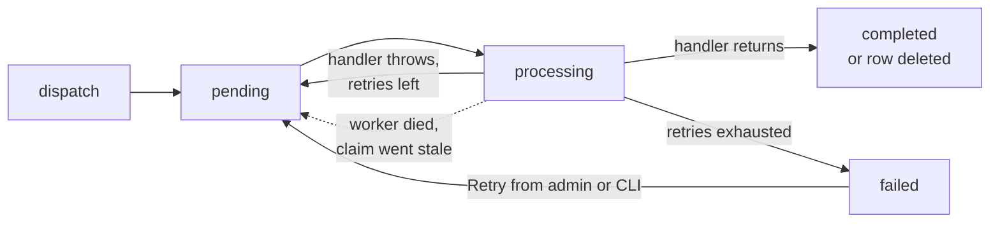

# Message Queue <span class="version-badge">v26.9+</span>

Maho ships a generic asynchronous job queue built on
[Symfony Messenger](https://symfony.com/doc/current/messenger.html){target=_blank}. You dispatch a plain
message object, a background worker picks it up and calls your handler. Failures are retried with
exponential backoff, everything is visible and actionable in the admin, and no extra infrastructure is
required: the default transport is your database, and cron keeps the worker alive for you.

Transactional emails already run through it, so the queue is exercised on every store.

## Quick start

Three pieces: a message, a handler, a dispatch call.

**1. The message** is a flat DTO. It carries data, not behaviour:

```php
final readonly class My_Module_Model_ImportRowMessage
{
    public function __construct(
        public int $productId,
        public string $sku,
    ) {}
}
```

**2. The handler** is any method carrying `#[Maho\Config\MessageHandler]`. The handled message class is
inferred from the first parameter type, and the declaring class is instantiated with `Mage::getSingleton()`
at consume time:

```php
class My_Module_Model_ImportHandler
{
    #[Maho\Config\MessageHandler]
    public function __invoke(My_Module_Model_ImportRowMessage $message): void
    {
        // do the slow work here
    }
}
```

```bash
composer dump-autoload   # required after adding, changing or removing the attribute
```

**3. Dispatch** from anywhere:

```php
\Maho\Queue\QueueManager::dispatch(new My_Module_Model_ImportRowMessage(42, 'ABC-123'));
```

That is the whole contract. The request returns immediately, and the worker running in the background
handles the message.

### Dispatch options

```php
QueueManager::dispatch(
    $message,
    delaySeconds: 300,          // earliest handling time
    queue: 'imports',           // logical queue name
    dedupeKey: 'import-42',     // collapse duplicates
    stamps: [],                 // extra Messenger stamps
);
```

| Argument | Default | Meaning |
|---|---|---|
| `$message` | required | The DTO to hand to the handler |
| `$delaySeconds` | `null` | Do not make the message available for at least this many seconds |
| `$queue` | `default` | Logical queue name, consumable in isolation with `queue:work --queue=<name>` |
| `$dedupeKey` | `null` | While a pending or processing message with the same key exists, dispatching is a no-op (DB transport) |
| `$stamps` | `[]` | Additional Messenger stamps, for advanced cases |

`dispatch()` returns the Messenger `Envelope` and throws a `RuntimeException` if the `Maho_Queue` module
is disabled.

### Handler attribute

```php
#[Maho\Config\MessageHandler]                                        // class inferred from the parameter
#[Maho\Config\MessageHandler(message: My_Module_Model_Foo::class)]   // explicit
#[Maho\Config\MessageHandler(priority: 10)]                          // higher runs first
```

Several handlers can subscribe to the same message class; they run in descending priority order.
Handlers belonging to disabled modules are ignored.

Attributes are compiled into `vendor/composer/maho_attributes.php`, so **run `composer dump-autoload`
after any change to a `#[MessageHandler]` attribute**, exactly like observers, cron jobs and routes.

## A complete example

Pushing every new order to an external ERP. The HTTP call must not slow down checkout, and it must
survive the ERP being down for an hour, which is exactly what the queue gives you.

Three files in a module (`app/code/local/My/Erp/`, declared as usual in `app/etc/modules/`).

**The message.** Identifiers only, no loaded models:

```php title="Model/OrderSyncMessage.php"
final readonly class My_Erp_Model_OrderSyncMessage
{
    public function __construct(
        public int $orderId,
        public string $incrementId,
    ) {}
}
```

**The observer** that dispatches it when an order is placed:

```php title="Model/Observer.php"
class My_Erp_Model_Observer
{
    #[Maho\Config\Observer('checkout_submit_all_after')]
    public function queueOrderSync(Maho\Event\Observer $observer): void
    {
        /** @var Mage_Sales_Model_Order $order */
        $order = $observer->getEvent()->getOrder();

        \Maho\Queue\QueueManager::dispatch(
            new My_Erp_Model_OrderSyncMessage((int) $order->getId(), $order->getIncrementId()),
            queue: 'erp',
            dedupeKey: 'erp-order-' . $order->getId(),
        );
    }
}
```

**The handler** that does the slow work:

```php title="Model/OrderSyncHandler.php"
use Symfony\Component\HttpClient\HttpClient;
use Symfony\Component\Messenger\Exception\UnrecoverableMessageHandlingException;

class My_Erp_Model_OrderSyncHandler
{
    #[Maho\Config\MessageHandler]
    public function __invoke(My_Erp_Model_OrderSyncMessage $message): void
    {
        $order = Mage::getModel('sales/order')->load($message->orderId);
        if (!$order->getId()) {
            // The order is gone: retrying will never help.
            throw new UnrecoverableMessageHandlingException("Order {$message->orderId} no longer exists");
        }

        // A transport failure throws, and the queue retries it with backoff.
        HttpClient::create(['timeout' => 30])->request('POST', 'https://erp.example.com/orders', [
            'json' => [
                'reference' => $message->incrementId,
                'total' => (float) $order->getGrandTotal(),
                'email' => $order->getCustomerEmail(),
            ],
        ])->getContent();

        $order->addStatusHistoryComment('Synced to the ERP.')->save();
    }
}
```

Then compile the attributes and try it:

```bash
composer dump-autoload
./maho queue:list                          # the 'erp' queue now has a pending message
./maho queue:work --queue=erp --stop-when-empty   # run it now instead of waiting for the worker
```

Place an order (or dispatch the message by hand from `./maho shell`) and watch it move through
**System > Tools > Message Queue**. If the ERP is down, the message shows up as `pending` with a
growing retry count, and lands as `failed` with the HTTP error once the retries run out; fix the ERP
and hit **Retry**.

In production you do not run `queue:work` yourself: the [worker](#the-worker) started by cron is
already consuming every queue.

## What a message may contain

The stored body is the serialized **message object only**, never the envelope. On the way back in,
the serializer refuses to unserialize anything that is not a registered message class, allowing only
those classes plus `DateTimeImmutable` and `DateTimeZone`.

Practically:

- keep messages flat: scalars, arrays, `DateTimeImmutable`, `DateTimeZone`
- pass **identifiers, not models**: `public int $orderId`, not a loaded `Mage_Sales_Model_Order`
- treat the payload as immutable data; `readonly` classes are a good fit
- a body that can no longer be decoded (class removed, payload corrupted) is marked `failed` with the
  decoding error, so it surfaces in the admin instead of being retried forever

## Failures, retries and backoff

If a handler throws, the message is retried according to the configured policy: `Initial Retry Delay`
seconds, multiplied by `Retry Delay Multiplier` on each attempt, capped at `Max Retry Delay`. With the
defaults, retries happen after roughly 1 minute, 4 minutes and 16 minutes, then the message is marked
`failed` and the exception is written to `var/log/exception.log`.

To fail immediately with no retries, throw Messenger's unrecoverable exception:

```php
use Symfony\Component\Messenger\Exception\UnrecoverableMessageHandlingException;

throw new UnrecoverableMessageHandlingException('Malformed recipient address');
```

Use it for input that will never become valid; let ordinary exceptions bubble for transient problems
(network timeouts, a mail server that is down) that a retry can fix.

Failed messages are never silently dropped. They stay in the table, visible in the admin grid, and can
be retried or discarded from there.

## The worker

Consumption is done by a long-running worker process. You normally never start it yourself: the
`queue_process` cron job runs every minute and acts as a watchdog. When no worker holds the
`queue.worker` lock, it spawns a detached `./maho queue:work --exclusive`, logging to
`var/log/queue-worker.log`.

Consequences worth knowing:

- **A dead worker is back within a minute.** The lock is a machine-local kernel flock, so it disappears
  the instant the process dies and doubles as the liveness probe.
- **Each application server runs its own worker.** Parallel consumption is safe: rows are claimed with an
  atomic conditional update, so two workers never process the same message.
- **The worker recycles hourly** (time limit 3600s, memory limit 256M), which is how newly deployed code
  gets picked up.
- **Configuration changes restart it.** A periodic checksum over `core_config_data` stops the worker when
  anything changes, so it never keeps running against stale settings (an old SMTP transport, for example).
- **Shutdown is graceful.** `SIGTERM`/`SIGINT` let the in-flight message finish before exiting.
- If PHP's `exec()` is disabled on the host, the watchdog cannot spawn anything and logs an error. Run
  `./maho queue:work` under your own process supervisor instead.

### CLI

```bash
./maho queue:work                       # consume all queues until stopped
./maho queue:work --queue=email         # only one queue (repeatable)
./maho queue:work --stop-when-empty     # drain and exit, handy in scripts
./maho queue:list                       # per-queue counts and the active transport
```

| `queue:work` option | Meaning |
|---|---|
| `--queue=NAME` | Only consume these queues (repeatable). Default: all |
| `--limit=N` | Stop after handling N messages |
| `--time-limit=SECONDS` | Stop after this many seconds |
| `--memory-limit=256M` | Stop once memory usage exceeds this limit |
| `--sleep=SECONDS` | Seconds to sleep when the queue is empty (default 1) |
| `--stop-when-empty` | Stop as soon as the queue is empty |
| `--exclusive` | Hold the `queue.worker` lock and refuse to start when another exclusive worker is active (used by the watchdog) |

`queue:list` prints pending, processing, failed and completed counts per queue, plus the oldest pending
message, which is the quickest way to spot a backlog.

## Admin

**System > Tools > Message Queue** lists messages with their queue, message class, status, retry count,
truncated error, availability and queue time. Opening a row shows the full error and the serialized body,
with **Retry** and **Discard** buttons; the grid offers both as mass actions.

Only `failed` messages can be retried, since flipping a claimed row would race the worker. Discarding
deletes the row permanently.

Three ACL resources under **System > Tools > Message Queue** let you split access: *View Messages*,
*Retry Messages* and *Discard Messages*.

## Configuration

**System > Configuration > Advanced > System > Message Queue**:

| Field | Config path | Default | Meaning |
|---|---|---|---|
| Max Retries | `system/queue/max_retries` | `3` | Retries before a message is marked failed |
| Initial Retry Delay (seconds) | `system/queue/retry_delay` | `60` | Wait before the first retry |
| Retry Delay Multiplier | `system/queue/retry_multiplier` | `4` | Each retry waits this many times longer |
| Max Retry Delay (seconds) | `system/queue/retry_max_delay` | `21600` | Upper bound for the backoff, `0` for none |
| Redeliver Stuck Messages After (seconds) | `system/queue/redeliver_after` | `3600` | Re-queue messages claimed by a worker that died. Keep it above the runtime of your slowest handler |
| Keep Completed Messages (days) | `system/queue/completed_retention` | `0` | `0` deletes on success, a positive value keeps rows visible in the grid |
| Keep Failed Messages (days) | `system/queue/failed_retention` | `30` | `0` keeps failed messages forever |

The `queue_clean_up` cron job runs at 02:00 daily and applies both retention settings.

Set `Keep Completed Messages` to a few days when you want an audit trail of what ran; leave it at `0` to
keep the table small.

## Storage and lifecycle

The default transport stores messages in `maho_queue_message`, through Maho's DBAL adapter, so it works
identically on MySQL, PostgreSQL and SQLite.



- a worker claims the oldest available row with an atomic `UPDATE ... WHERE status = 'pending'`
- on success the row becomes `completed`, or is deleted outright when completed retention is `0`
- rows stuck in `processing` longer than `redeliver_after` are assumed to belong to a dead worker and
  are put back up for grabs
- **dispatching inside a database transaction participates in it**: the message becomes visible to
  workers only when the transaction commits, so a handler can never see an entity that was rolled back

## Redis transport

For high volume you can move pending messages to Redis. Install the bridge and point Maho at it in
`app/etc/local.xml`:

```bash
composer require symfony/redis-messenger
```

```xml
<global>
    <queue>
        <dsn>redis://localhost:6379/messages</dsn>
    </queue>
</global>
```

Everything else stays the same, with two differences: pending messages live in Redis and therefore do not
appear in the admin grid (which says so with a notice), and **final failures are still written to the
database table**, so failure inspection, retry and discard keep working exactly as before.

If the DSN is set but the bridge package is missing, Maho fails loudly rather than silently falling back
to the database.

## Emails on the queue

Transactional emails are queued messages: `Mage_Core_Model_Email_SendMessage` handled by
`Mage_Core_Model_Email_SendMessageHandler`, on the `email` queue. So they get retries, backoff and the
same admin grid as everything else, and malformed recipient addresses fail immediately instead of being
retried.

- `Mage_Core_Model_Email_Queue::addMessageToQueue()` still works as a shim; new code should dispatch
  `Mage_Core_Model_Email_SendMessage` through `QueueManager::dispatch()` directly
- the old "force check" duplicate guard is now a dedupe key
- in [developer mode](guide/models-and-orm.md#enable-developer-mode) emails are sent synchronously, so
  errors surface immediately and you do not need a worker locally
- `./maho email:queue:process` drains the `email` queue once, `./maho email:queue:clear` removes email
  messages by status and age
- upgrading migrates any unsent `core_email_queue` rows onto the new queue automatically

## Testing

`QueueManager::reset()` drops every memoised service (bus, transport, serializer, handler registry).
Call it between tests, or after changing configuration that the queue reads, to force a clean rebuild.

To assert on what a piece of code queued, dispatch it and read `maho_queue_message` through
`Mage::getModel('queue/message')->getCollection()`; to run the work inline, build a bounded worker with
`\Maho\Queue\WorkerFactory::create(['stopWhenIdle' => true])`.
