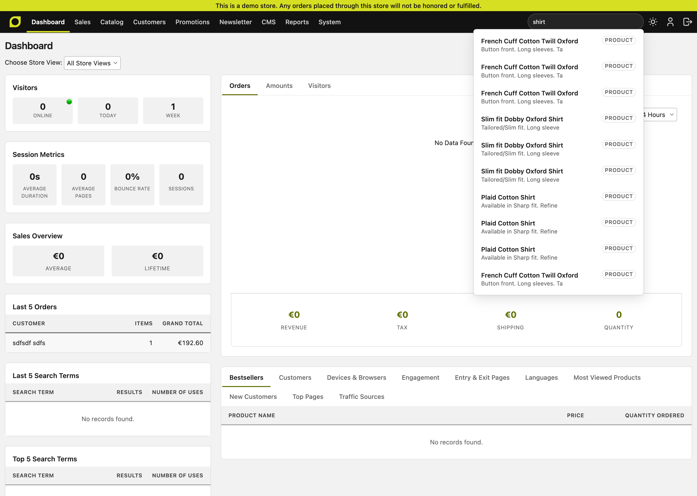
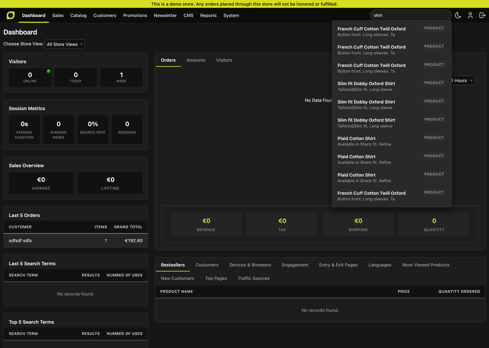
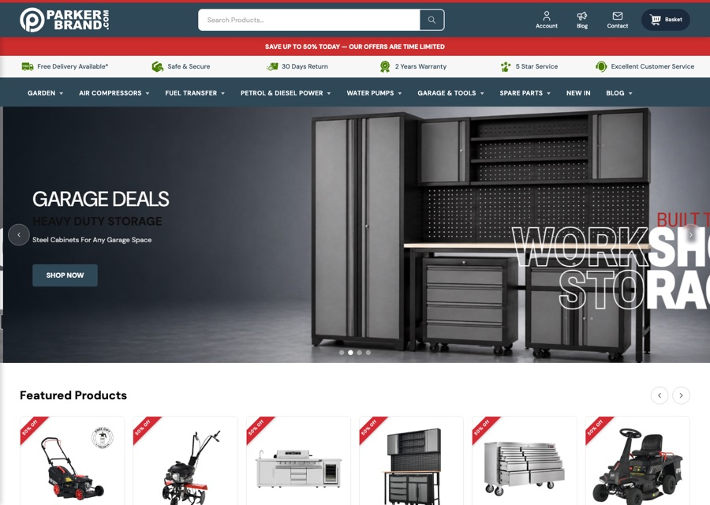
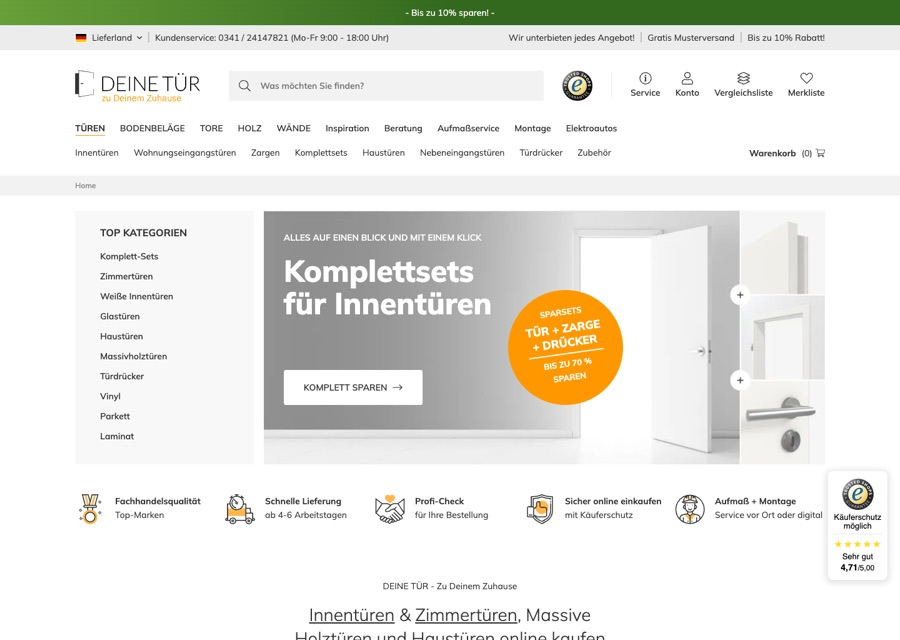
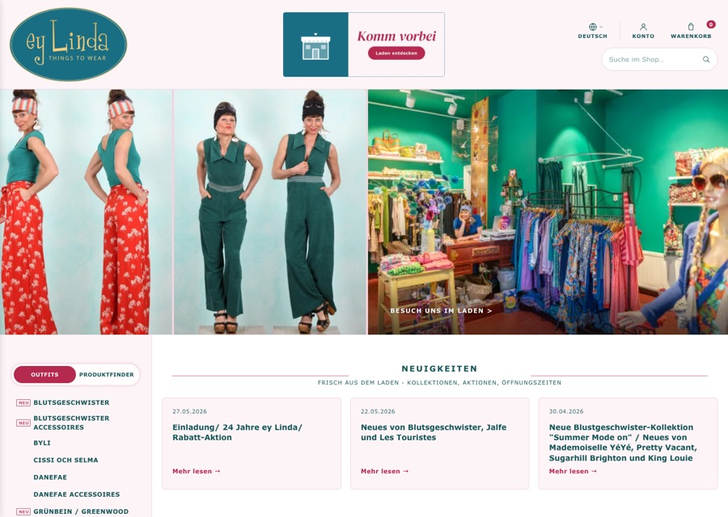

<svg width="0" height="0" focusable="false">
  <filter id="maho-duo-ink" color-interpolation-filters="sRGB">
    <feColorMatrix type="matrix" values="0.33 0.34 0.33 0 0  0.33 0.34 0.33 0 0  0.33 0.34 0.33 0 0  0 0 0 1 0"/>
    <feComponentTransfer>
      <feFuncR type="table" tableValues="0.13 0.99"/>
      <feFuncG type="table" tableValues="0.13 0.988"/>
      <feFuncB type="table" tableValues="0.12 0.97"/>
    </feComponentTransfer>
  </filter>
</svg>

<section class="mh-hero" aria-label="Maho - open-source on-premises ecommerce platform">
  

    

      <h1 id="homeh1" class="mh-headline">Maho - Your store, <em>your rules.</em></h1>
      
The ecommerce platform you actually own. Lean at the core, fully featured out of the box, and open to extend however you like. Self-hosted, with no fees skimming your margins and no vendor holding the keys.

      

        ● Open source
        ● Self-hosted
        ● Forever free
      

      

        <a class="mh-btn mh-btn-solid" href="demo/">Try the live demo
          <svg width="16" height="16" viewBox="0 0 24 24" fill="none" stroke="currentColor" stroke-width="2.5" stroke-linecap="round" stroke-linejoin="round" aria-hidden="true"><path d="M5 12h14M13 6l6 6-6 6"/></svg></a>
        <a class="mh-btn mh-btn-line" href="getting-started/">Get started</a>
        <a class="mh-btn mh-btn-ghost" href="https://discord.gg/dWgcVUFTrS">Join the community</a>
      

    

    

      

      

        

          
          maho@yourserver
        

        

          

            
# spin up a new store in one line

            
$ composer create-project mahocommerce/maho-starter my-shop

            
  ✓ Installing mahocommerce/maho

            
  ✓ Generating autoload files

            
  ✓ Running database migrations

            
  ✓ Maho installed · admin at /admin

            
$ cd my-shop && ./maho serve

          

          

            
# prefer containers? try it instantly

            
$ docker run -p 54321:443 mahocommerce/maho:nightly

            
  ✓ Pulling mahocommerce/maho:nightly

            
  ✓ Starting Maho · SQLite, zero config

            
  ✓ Web installer ready

            
  ✓ Running at https://localhost:54321

            
$ open https://localhost:54321

          

        

      

      

      
One command to a running store. No account, no signup, no meter running.

    

  

  

    

      

        
        maho-admin · light
        

          Try dark mode →
          <button class="mh-bulb" id="mh-bulb" type="button" aria-pressed="false" aria-label="Switch the screenshot to dark mode" title="Toggle light / dark">
            <svg viewBox="0 0 24 24" width="16" height="16" fill="none" stroke="currentColor" stroke-width="1.8" stroke-linecap="round" stroke-linejoin="round" aria-hidden="true">
              <path d="M9 18h6"/><path d="M10 21h4"/>
              <path d="M12 3a6 6 0 0 0-4 10.5c.7.7 1 1.2 1 2.5h6c0-1.3.3-1.8 1-2.5A6 6 0 0 0 12 3z"/>
            </svg>
          </button>
        

      

      

        
        

          
          
        

        <button class="mh-shot-nav mh-shot-prev" id="mh-shot-prev" type="button" aria-label="Previous screen">
          <svg viewBox="0 0 24 24" width="30" height="30" fill="none" stroke="currentColor" stroke-width="2.4" stroke-linecap="round" stroke-linejoin="round" aria-hidden="true"><path d="M15 6l-6 6 6 6"/></svg>
        </button>
        <button class="mh-shot-nav mh-shot-next" id="mh-shot-next" type="button" aria-label="Next screen">
          <svg viewBox="0 0 24 24" width="30" height="30" fill="none" stroke="currentColor" stroke-width="2.4" stroke-linecap="round" stroke-linejoin="round" aria-hidden="true"><path d="M9 6l6 6-6 6"/></svg>
        </button>
        

      

    

    

      <i data-light="assets/admin-screens/dashboard-light.png" data-dark="assets/admin-screens/dashboard-dark.png" data-title="Dashboard"></i>
      <i data-light="assets/admin-screens/products-grid-light.png" data-dark="assets/admin-screens/products-grid-dark.png" data-title="Products grid"></i>
      <i data-light="assets/admin-screens/product-edit-light.png" data-dark="assets/admin-screens/product-edit-dark.png" data-title="Product edit"></i>
      <i data-light="assets/admin-screens/system-config-light.png" data-dark="assets/admin-screens/system-config-dark.png" data-title="System config"></i>
      <i data-light="assets/admin-screens/cms-editor-light.png" data-dark="assets/admin-screens/cms-editor-dark.png" data-title="CMS editor"></i>
      <i data-light="assets/admin-screens/category-tree-light.png" data-dark="assets/admin-screens/category-tree-dark.png" data-title="Category tree"></i>
      <i data-light="assets/admin-screens/navigation-light.png" data-dark="assets/admin-screens/navigation-dark.png" data-title="Navigation"></i>
      <i data-light="assets/admin-screens/health-check-light.png" data-dark="assets/admin-screens/health-check-dark.png" data-title="Health check"></i>
      <i data-light="assets/admin-screens/cache-management-light.png" data-dark="assets/admin-screens/cache-management-dark.png" data-title="Cache management"></i>
    

    
A completely redesigned admin, first-class dark mode included, shipping in Maho 26.7. Use the arrows to browse screens, hit the lightbulb to flip the theme. <a href="demo/">Try it in the live demo →</a>

  

</section>

<section class="mh-stores" aria-label="Real stores running Maho">
  

    

      <h2 class="mh-sec-title">Selling on Maho <strong>right now</strong></h2>
      
Worldwide merchants run their storefronts on Maho. Click through and see for yourself.

    

    

      <button class="mh-stores-arrow mh-stores-prev" type="button" aria-label="Previous stores">
        <svg viewBox="0 0 24 24" width="26" height="26" fill="none" stroke="currentColor" stroke-width="2.4" stroke-linecap="round" stroke-linejoin="round" aria-hidden="true"><path d="M15 6l-6 6 6 6"/></svg>
      </button>
      

        

          <a class="mh-store-card" href="https://www.parkerbrand.co.uk" target="_blank" rel="noopener">
            
            
              Parker Brand
              🇬🇧 United Kingdom · Garden &amp; workshop
            
          </a>
          <a class="mh-store-card" href="https://www.deinetuer.de" target="_blank" rel="noopener">
            
            
              Deine Tür
              🇪🇺 Europe-wide · Doors &amp; interiors
            
          </a>
          <a class="mh-store-card" href="https://www.mooremilitaria.com" target="_blank" rel="noopener">
            
            
              Moore Militaria
              🇺🇸 United States · Militaria &amp; collectibles
            
          </a>
          <a class="mh-store-card" href="https://www.eylinda.de" target="_blank" rel="noopener">
            
            
              ey Linda
              🇩🇪 Germany · Fashion &amp; apparel
            
          </a>
        

      

      <button class="mh-stores-arrow mh-stores-next" type="button" aria-label="More stores">
        <svg viewBox="0 0 24 24" width="26" height="26" fill="none" stroke="currentColor" stroke-width="2.4" stroke-linecap="round" stroke-linejoin="round" aria-hidden="true"><path d="M9 6l6 6-6 6"/></svg>
      </button>
    

    

      Is your store running on Maho?
      <a class="mh-btn mh-btn-solid" href="mailto:info@mahocommerce.com?subject=Add%20my%20store%20to%20mahocommerce.com&amp;body=Store%20name%3A%0AStore%20URL%3A%0ACountry%3A%0AWhat%20you%20sell%3A%0A%0AHappy%20for%20Maho%20to%20feature%20my%20store%3A%20yes">Showcase it here
        <svg width="15" height="15" viewBox="0 0 24 24" fill="none" stroke="currentColor" stroke-width="2.5" stroke-linecap="round" stroke-linejoin="round" aria-hidden="true"><path d="M5 12h14M13 6l6 6-6 6"/></svg></a>
    

    

      

        Whoever you are, Maho is for you
        

          <a class="mh-audience-pill" href="#for-store-owners">
          <svg class="mh-pill-icon" width="18" height="18" viewBox="0 0 24 24" fill="none" stroke="currentColor" stroke-width="2" stroke-linecap="round" stroke-linejoin="round" aria-hidden="true"><path d="M3 9 4.5 4h15L21 9M4 9v10a1 1 0 0 0 1 1h14a1 1 0 0 0 1-1V9M4 9h16M9 13a3 3 0 0 0 6 0"/></svg>
          Store owners
        </a>
        <a class="mh-audience-pill" href="#for-agencies">
          <svg class="mh-pill-icon" width="18" height="18" viewBox="0 0 24 24" fill="none" stroke="currentColor" stroke-width="2" stroke-linecap="round" stroke-linejoin="round" aria-hidden="true"><rect x="2" y="7" width="20" height="14" rx="2"/><path d="M16 21V5a2 2 0 0 0-2-2h-4a2 2 0 0 0-2 2v16"/></svg>
          Agencies
        </a>
        <a class="mh-audience-pill" href="#for-developers">
          <svg class="mh-pill-icon" width="18" height="18" viewBox="0 0 24 24" fill="none" stroke="currentColor" stroke-width="2" stroke-linecap="round" stroke-linejoin="round" aria-hidden="true"><path d="m16 18 6-6-6-6M8 6l-6 6 6 6"/></svg>
          Developers
        </a>
        

      

    

  

</section>

<h2 class="mh-sec-title" markdown>For **store owners**</h2>

Run your store with enterprise features that actually help you sell more, without the enterprise price tag or complexity.

:material-auto-fix:{ .feature-icon }

### Smart Automation That Saves Time

Create **rule-based customer segments** and **dynamic categories** that update **automatically**. Target the right customers with personalized campaigns while products organize themselves based on rules you define. Spend less time on manual work, more time growing.

:material-email-multiple:{ .feature-icon }

### Email Automation That Works While You Sleep

Build **multi-step email campaigns** that trigger automatically based on customer behavior. Send **personalized coupon codes**, nurture leads, and re-engage customers with **customizable delays** between messages. **GDPR-compliant** tracking ensures you stay on the right side of privacy laws.

:material-bullhorn:{ .feature-icon }

### Marketing Tools Built Right In

Integrated **blog module** for content marketing and SEO, **Meta Pixel** for conversion tracking, professional **SMTP** email sending, and advanced **payment method restrictions**. Everything you need to market and sell strategically, **no third-party plugins** required.

:material-shopping:{ .feature-icon }

### Checkout That Converts

Modern **minimal checkout layout**, **offcanvas navigation**, and blazing-fast **autocomplete search** create a smooth shopping experience. Fast page loads mean happy customers and **better conversion rates**.

:material-image-edit:{ .feature-icon }

### Professional Content Creation

**Edit and optimize product images** directly in the **media library**. Create beautiful product descriptions, CMS pages, and **engaging slideshows** with the modern **TipTap editor** - intuitive, powerful, and **no external tools** needed.

:material-shield-check:{ .feature-icon }

### Enterprise-Level Security

Protect your business with **2-factor authentication**, **passkey support** for backend login, **admin activity logging**, **GDPR-compliant captcha**, and modern **libsodium encryption**. Sleep well knowing your store is secure.

:material-rocket-launch:{ .feature-icon }

### Always Getting Better

Regular updates with real improvements like **email automation** (25.11), **customer segmentation** (25.9), **dynamic categories** (25.7), **modern content editor** (25.7), and **enhanced security** (25.3). Maho evolves with your business needs.

<h2 class="mh-sec-title" markdown>For **agencies**</h2>

Deliver professional ecommerce solutions to clients with a platform that's proven, powerful, and cost-effective.

:material-monitor-dashboard:{ .feature-icon }

### Client-Ready Platform

Clean, modern **admin interface** with professional features clients expect: **media management**, **content editor**, **activity logs**, and comprehensive reporting. Built-in **blog and marketing tools** mean you deliver more value out of the box.

:material-rocket:{ .feature-icon }

### Fast Project Deployment

**Docker support** for consistent environments, **environment variable configuration** for easy setup, and modern development tools. Get client projects live **faster with less friction**.

:material-cash-multiple:{ .feature-icon }

### Enterprise Features, Zero Licensing

**Multi-store capabilities**, advanced permissions, comprehensive **APIs** (REST, SOAP, JSON-RPC), and all the features enterprise clients demand. **No per-client licensing fees**, **no SaaS subscriptions** - pure profit margin.

:material-account-group:{ .feature-icon }

### Independent, Not Isolated

Maho stands on a **[battle-tested open-source foundation](about/origins.md)**, hardened by real stores running in production. **Active development**, thorough documentation, and **direct access to the maintainers** mean you're never stuck.

:material-book-open-page-variant:{ .feature-icon }

### Complete Documentation

Comprehensive **API documentation** (REST, SOAP, JSON-RPC), **developer guides** covering MVC, ORM, and architecture, plus **[AI-powered deep code documentation](https://deepwiki.com/MahoCommerce/maho){:target="_blank"}** via DeepWiki. Onboard new team members quickly and reduce training costs.

:material-server:{ .feature-icon }

### On-Premises Control

**Self-hosted** means your clients **own their data** and you control the infrastructure. **No vendor lock-in**, **no platform fees** eating margins, **no forced migrations**. Perfect for clients with compliance requirements.

<h2 class="mh-sec-title" markdown>For **developers**</h2>

Build with a modern tech stack and clean architecture, no legacy baggage, just great developer experience.

:material-language-php:{ .feature-icon }

### Modern Tech Stack

**PHP 8.3+** built on industry-standard libraries: **Doctrine DBAL 4.4** for database operations, **Symfony HttpClient** for HTTP requests, **Symfony Validator** for data validation, **Monolog** for logging, and **DomPDF** for documents. **Vanilla JavaScript only** throughout. Contemporary, actively-maintained dependencies you can trust.

:material-layers:{ .feature-icon }

### Clean Architecture

Well-designed **MVC pattern**, powerful **ORM with collections**, **event-driven system**, and **modular architecture**. Code that makes sense, patterns you recognize, structure you can extend confidently.

:material-api:{ .feature-icon }

### Comprehensive APIs

Full **REST API** with **OAuth authentication**, **SOAP API** for legacy integrations, and **JSON-RPC** for modern applications. Detailed permission settings, role configuration, and extensive attribute control.

:material-tools:{ .feature-icon }

### Great Developer Tools

**CLI tool** for common tasks, **Composer plugin** for module management, **5800+ icon library**, **CSS variables** for theming, and **environment-based configuration**. Tools that actually improve your workflow.

:material-database:{ .feature-icon }

### Multi-Database Support

Choose the database that fits your infrastructure. **MySQL**, **MariaDB**, **PostgreSQL**, and **SQLite** are all supported through **Doctrine DBAL**, with automatic SQL dialect handling. Your code works across all engines without modification.

:material-update:{ .feature-icon }

### Actively Developed

**Regular releases** with substantial improvements - not just patches. Recent additions: **Doctrine DBAL 4.4** database layer, **native HTML5 date inputs** with timezone support, **Symfony Cache** subsystem, **libsodium encryption**, **customer segmentation**, and **dynamic categories**. Continuous modernization with real features that matter.

:material-puzzle-outline:{ .feature-icon }

### Extensible by Design

**Module system** for clean extensions, **setup resources** for database migrations, **event observers** for behavior modification, **layout XML** for frontend customization. Build what you need without fighting the framework.

<section class="final-cta" aria-label="Get started with Maho">
  

    <h2>Ready to build the future of <em>your</em> ecommerce?</h2>
    
Whether you're launching your first store, delivering client projects, or building custom solutions, Maho gives you the foundation to succeed.

    

      <a class="mh-btn mh-btn-solid" href="getting-started/">Get started with Maho
        <svg width="16" height="16" viewBox="0 0 24 24" fill="none" stroke="currentColor" stroke-width="2.5" stroke-linecap="round" stroke-linejoin="round" aria-hidden="true"><path d="M5 12h14M13 6l6 6-6 6"/></svg></a>
      <a class="mh-btn mh-btn-line" href="demo/">Try the demo</a>
      <a class="mh-btn mh-btn-ghost" href="https://discord.gg/dWgcVUFTrS">Join the community</a>
    

  

</section>
