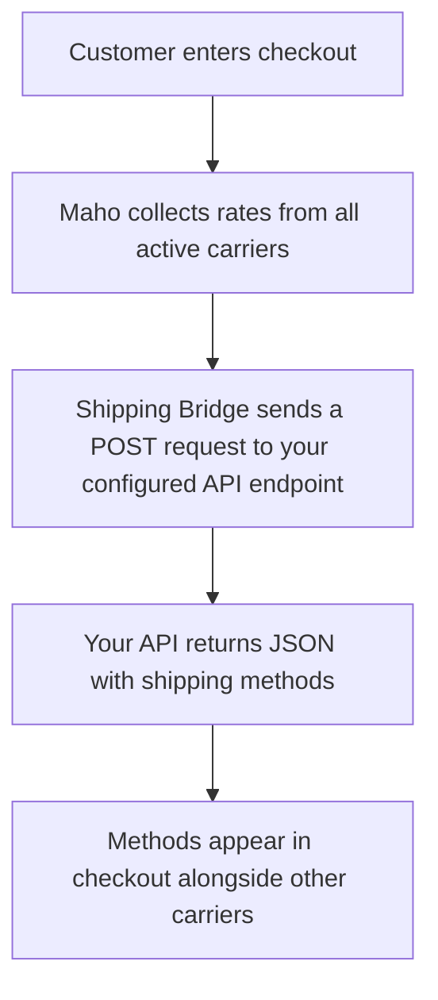

# Shipping Bridge <span class="version-badge">v26.3+</span>

Maho's Shipping Bridge module lets you delegate shipping rate calculation to any external API. Instead of writing a custom carrier module, you configure a single API endpoint URL and Maho sends the full cart and address data as a JSON POST request, then renders whatever shipping methods the API returns.

## Overview

Traditional carrier integrations require a dedicated module for every shipping provider. Shipping Bridge replaces that pattern with a single, generic connector:

- **One module, any provider**: Point it at a microservice, a serverless function, a third-party TMS, or your own ERP
- **Zero code required**: Everything is configured in the admin panel
- **Rich payload**: The API receives cart items, totals, shipping address, customer data, and any additional product attributes you select
- **Flexible authentication**: None, Bearer token, or custom header
- **Multi-store support**: Configuration is scoped per website

## Use Cases

### Third-party Shipping API

Connect to any shipping provider that offers a rate calculation API. Build a thin middleware that translates Maho's payload into the provider's format and returns the results.

### Custom Business Rules

Deploy a serverless function (AWS Lambda, Cloudflare Workers, etc.) that implements your specific shipping logic -- zone-based pricing, weight tiers, customer group discounts, product category rules, or any combination.

### ERP / WMS Integration

Point the endpoint at your ERP or warehouse management system to get real-time rates based on actual inventory locations and carrier contracts.

### Multi-carrier Aggregation

Build a single endpoint that queries multiple carriers (UPS, FedEx, DHL) in parallel and returns the combined results as a unified list of methods.

## How It Works



## Configuration

Navigate to **System > Configuration > Sales > Shipping Methods > Shipping Bridge**.

### Settings Reference

| Setting | Description | Scope |
|---------|-------------|-------|
| **Enabled** | Activate the carrier | Website |
| **Title** | Carrier title shown in checkout (e.g. "Express Shipping") | Store View |
| **API Endpoint URL** | The URL Maho will POST to | Website |
| **Authentication Type** | `None`, `Bearer Token`, or `Custom Header` | Website |
| **Auth Token** | Token value (encrypted in database) | Website |
| **Custom Header Name** | Header name when using Custom Header auth (e.g. `X-Api-Key`) | Website |
| **Request Timeout** | Seconds to wait for a response (max 60) | Website |
| **Additional Product Attributes** | Extra product attributes to include in the request payload | Website |
| **Debug Mode** | Log full request/response to `var/log/shipping_bridge.log` | Website |
| **Sort Order** | Position among other shipping methods | Website |
| **Ship to Applicable Countries** | All countries or specific countries only | Website |
| **Ship to Specific Countries** | Country whitelist (when above is set to specific) | Website |
| **Displayed Error Message** | Shown to customers when the method is unavailable | Store View |

### Authentication Types

- **None** -- No authentication header is sent
- **Bearer Token** -- Sends `Authorization: Bearer <token>` header
- **Custom Header** -- Sends a custom header, e.g. `X-Api-Key: <token>`. The header name must contain only letters, numbers, and hyphens.

### Additional Product Attributes

By default each cart item includes `sku`, `name`, `qty`, `weight`, `price`, and `row_total`. If your API needs more data (e.g. `color`, `manufacturer`, `shipping_class`), select those attributes in the **Additional Product Attributes** multiselect. They will be appended to each item in the request payload.

For `select` and `multiselect` attributes, both the raw value and the admin label are sent:

```json
{
  "color": {
    "value": "25",
    "label": "Red"
  }
}
```

For all other attribute types the raw value is sent directly.

## API Contract

### Request

Maho sends an HTTP **POST** with `Content-Type: application/json`.

```json
{
  "cart": {
    "items": [
      {
        "sku": "shirt-red-m",
        "name": "Classic T-Shirt",
        "qty": 2,
        "weight": 0.5,
        "price": 29.99,
        "row_total": 59.98,
        "color": { "value": "25", "label": "Red" },
        "size": { "value": "168", "label": "M" }
      }
    ],
    "totals": {
      "subtotal": 59.98,
      "weight": 1.0,
      "qty": 2
    }
  },
  "shipping_address": {
    "firstname": "John",
    "lastname": "Doe",
    "street": "123 Main St",
    "city": "Portland",
    "region": "Oregon",
    "region_code": "OR",
    "postcode": "97201",
    "country_id": "US"
  },
  "currency": "USD",
  "store_id": 1,
  "customer": {
    "customer_id": 42,
    "email": "john@example.com",
    "group_id": 1,
    "group_code": "General",
    "is_guest": false
  }
}
```

#### Request Fields

**`cart.items[]`**

| Field | Type | Description |
|-------|------|-------------|
| `sku` | string | Product SKU (for configurables, this is the simple product SKU) |
| `name` | string | Product name |
| `qty` | float | Quantity |
| `weight` | float | Unit weight |
| `price` | float | Unit price |
| `row_total` | float | Line total |
| *additional* | mixed | Any attributes selected in configuration |

**`cart.totals`**

| Field | Type | Description |
|-------|------|-------------|
| `subtotal` | float | Cart subtotal |
| `weight` | float | Total weight |
| `qty` | float | Total item count |

**`shipping_address`**

| Field | Type | Description |
|-------|------|-------------|
| `firstname` | string | First name |
| `lastname` | string | Last name |
| `street` | string | Street address |
| `city` | string | City |
| `region` | string | Full region/state name |
| `region_code` | string | Region code (e.g. "OR") |
| `postcode` | string | Postal/ZIP code |
| `country_id` | string | ISO 2-letter country code |

**`customer`**

| Field | Type | Description |
|-------|------|-------------|
| `customer_id` | int/null | Customer ID (null for guests) |
| `email` | string | Email address |
| `group_id` | int | Customer group ID |
| `group_code` | string | Customer group code (e.g. "General", "Wholesale") |
| `is_guest` | bool | Whether the customer is a guest |

### Response

Your API must return JSON with a `methods` array. Each method needs `code`, `title`, and `price`. Optional fields: `cost`, `description`, `logo`.

```json
{
  "methods": [
    {
      "code": "standard",
      "title": "Standard Shipping (5-7 days)",
      "price": 5.99,
      "cost": 3.50,
      "description": "Delivered by USPS",
      "logo": "https://example.com/usps-logo.svg"
    },
    {
      "code": "express",
      "title": "Express Shipping (1-2 days)",
      "price": 14.99,
      "cost": 10.00
    }
  ]
}
```

#### Response Fields

| Field | Type | Required | Description |
|-------|------|----------|-------------|
| `code` | string | Yes | Unique method identifier |
| `title` | string | Yes | Label shown to the customer |
| `price` | float | Yes | Price charged to the customer |
| `cost` | float | No | Internal cost (defaults to `price` if omitted) |
| `description` | string | No | Additional description |
| `logo` | string | No | URL to a carrier/method logo image |

#### Error Handling

- **Non-2xx status codes**: No shipping methods are shown; an error is logged
- **Invalid JSON**: Logged as an error; no methods shown
- **Missing `methods` array**: Logged as an error; no methods shown
- **Individual method missing required fields**: That method is skipped with a warning; other valid methods still appear

Return an empty `methods` array if no shipping options are available:

```json
{
  "methods": []
}
```

## Configurable Product Handling

For configurable products, the request payload includes:

- The **configurable product's** name and price
- The **selected simple product's** SKU
- **Super attributes** (the attributes used to configure the product, e.g. color, size) are always included automatically, resolved from the selected child product
- **Additional attributes** are resolved from the child product first, falling back to the parent if the child doesn't have a value

## Ship-Separately Items

When a bundle or grouped product is configured to ship items separately, each child item is sent as its own entry in the `items` array with the combined quantity (parent qty * child qty).

## Debug Mode

When **Debug Mode** is enabled, full request and response payloads are logged to `var/log/shipping_bridge.log`. This is useful during initial integration but should be disabled in production to avoid logging sensitive customer data.

Example log entries:

```
Shipping Bridge Request:
URL: https://api.example.com/rates
{"cart":{"items":[...],"totals":{...}},"shipping_address":{...},...}

Shipping Bridge Response:
{"methods":[{"code":"standard","title":"Standard","price":5.99}]}
```

