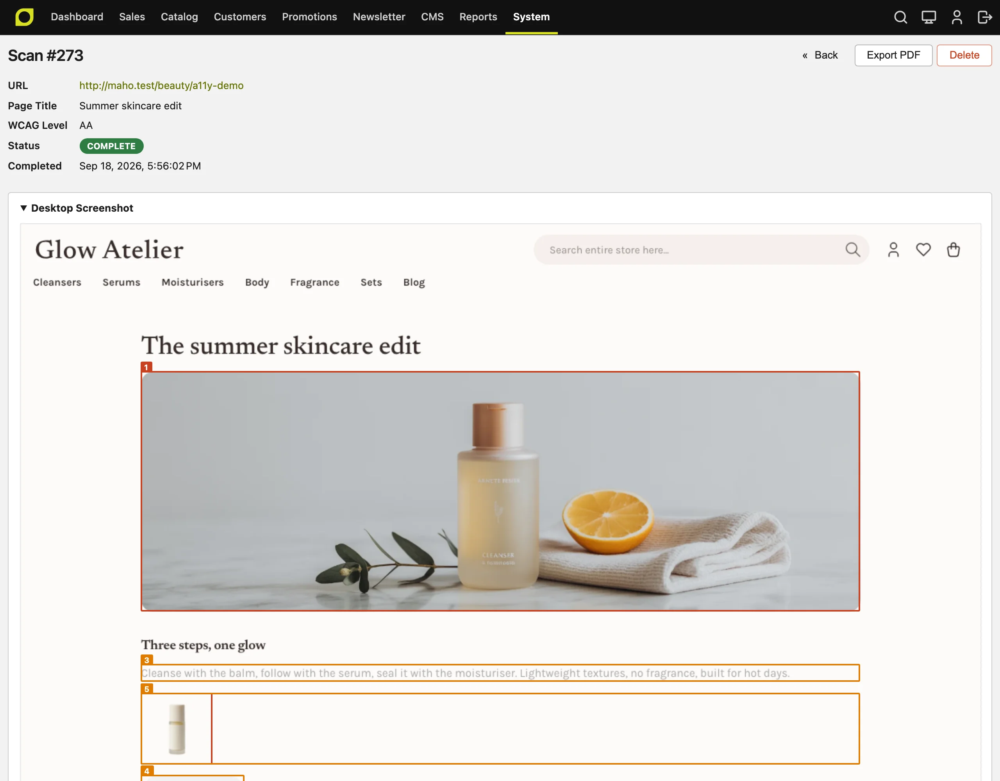

# Accessibility scan <span class="version-badge">v26.9+</span>

Maho ships a built-in accessibility scanner. It opens a page of your store in a headless browser, runs the [axe-core](https://github.com/dequelabs/axe-core) rule engine against it on a desktop and a mobile viewport, and stores every violation with a screenshot, the failing element, the WCAG criterion, and the `.phtml` template and line that rendered it. You run it from the admin or from the command line, and you can schedule it to run every night.

!!! info "Why this matters"
    The European Accessibility Act applies to online shops since June 2025, and it points to EN 301 549, which in turn requires WCAG 2.1 Level AA. Similar rules exist in the United States, the United Kingdom, Canada and Australia. An automated scanner does not make a store conformant on its own, but it finds the mechanical problems fast, on every release, before a customer or an auditor does.

!!! warning "Automated checks cover part of WCAG"
    axe-core finds roughly one third to one half of the WCAG success criteria. It cannot judge keyboard flow, focus order, screen reader semantics in context, the quality of alt text, or the meaning of content. Every report ends with the number of checks that need a manual review. A conformance claim needs a manual audit by a person with assistive technology.

## Requirements

The scanner runs on a shared browser runtime: Playwright with a headless Chromium build, installed under `var/browser-runtime`. It needs:

- Node.js 20 or newer, and npm, on the server that runs Maho.
- Disk space for the browser build.
- Outbound network access during the install, to download the packages and the browser.

Install the runtime once from the command line:

```bash
./maho sys:playwright:install
```

The command installs Playwright, axe-core and the headless browser. Run it again with `--force` to reinstall. If `node` or `npm` are not on the PATH of the web server user, set their full paths under **System > Configuration > System > Browser Runtime**. The same section lets you move the runtime directory. The admin dashboard tells you when the runtime is missing or when Node.js is too old.

## Run a scan from the admin

Open **System > Tools > Accessibility Scan**. The dashboard shows the total number of scans, the violations of the latest scan, the scan history, and a form to start a new one.

1. Enter the URL of the page to scan. The URL must belong to one of the base URLs of your stores. The scanner will not open an arbitrary address, because it runs from your server.
2. Pick the WCAG level: A, AA or AAA. The default comes from the configuration.
3. Click **Start Scan**. A scan takes between a few seconds and a couple of minutes, because every page is loaded twice, once per viewport. The page polls for the result, and the scan keeps running on the server even if you close the tab.

The store for the scan is derived from the URL. If your stores share one domain and use the store code in the path, the URL already names the store.



## Read the report

A report opens from the scan history. It has three parts.

**Summary.** The URL, the WCAG level, the status, the time, and the violation counts by impact: critical, serious, moderate and minor. The impact comes from axe-core and describes how badly the problem blocks a user, not how hard it is to fix.

**Violations.** One entry per distinct problem. The same element failing on both viewports counts once, and the entry lists the viewports it was seen on. Each entry shows:

- The axe-core rule, its impact, the WCAG success criteria it maps to, and a **Learn more** link to the rule documentation.
- The CSS selector and the HTML of the failing element.
- **How to fix**, the concrete conditions axe-core reports, for example the contrast ratio measured and the ratio required.
- **Template source**, the `.phtml` file and line that rendered the element. The scanner asks Maho to render the page with template hints for that one request, so it can map every element back to the template. The mapping needs no configuration and leaves no trace on the store.
- **Show on desktop screenshot** and **Show on mobile screenshot**, which scroll to the element on the full-page screenshot, where it is outlined and numbered.

**Needs review.** The checks axe-core could not decide by itself, for example a text over a background image. These are not failures. They are the list to go through by hand.

**Export PDF** writes the report to a file with the screenshots and the numbered markers drawn in, for a ticket or a client. The PDF is rendered by DomPdf and is not tagged, so it is not itself an accessible document. The admin view is the accessible version.

## Run a scan from the command line

```bash
./maho accessibility:scan --url https://store.example.com/ --level AA
```

| Option | Meaning |
|---|---|
| `--url` | The page to scan. Must belong to a configured store base URL. |
| `--level` | `A`, `AA` or `AAA`. Defaults to the configured level. |
| `--format` | `table` (default) or `json`. The JSON holds every field the admin view shows. |
| `--threshold` | Exit with code 1 when the number of violations is above this value. |
| `--reinstall-playwright` | Reinstall the browser runtime before the scan. |

The exit code is 0 on success, 1 when the threshold is exceeded, and 2 when the scan itself failed. This makes the command usable in a deployment pipeline: scan the staging store after a deploy and fail the pipeline when a new violation appears. Every command-line scan is also stored and appears in the admin history, marked as triggered by the CLI.

## Scheduled scans

Under **System > Configuration > Accessibility Scan > Scheduled Scans** you can enable a nightly run:

- **Enabled** turns the cron job on.
- **URLs to Scan** takes one URL per line. Each must belong to a store base URL. The list is checked again on every run, so a URL that no longer matches a store is skipped and logged.
- **Cron Schedule** is a cron expression. The default is `0 3 * * *`, every day at 3 am.

Scheduled scans use the default WCAG level. They appear in the history marked as scheduled, and a run with failed URLs lists them in the cron schedule message.

## Configuration

**System > Configuration > Accessibility Scan > General Settings**:

| Setting | Default | Meaning |
|---|---|---|
| Default WCAG Level | AA | The level used when a scan starts without an explicit level. |
| Scan Timeout | 60 | Seconds to wait for one page load per viewport. |
| Desktop Viewport | 1280x1024 | Width x height in CSS pixels for the desktop pass. |
| Mobile Viewport | 390x844 | Width x height for the mobile pass, scanned with mobile emulation. |
| Delete Scans After | 90 | Scans older than this many days are deleted by a daily cron job. 0 keeps everything. |

Levels are cumulative. A scan at AA runs every Level A and Level AA rule from WCAG 2.0, 2.1 and 2.2. A scan at AAA adds the Level AAA rules, which few stores target.

## Scan reports for the Maho themes

We run the scanner on our own storefront themes. This section publishes the results of the latest full run: every theme, every main page type, desktop and mobile, against WCAG 2.2 Level AA.

!!! warning "This is not an accessibility certification"
    These reports come from automated testing only, with the limits described at the top of this page. Treat them as evidence that the themes start from a clean base, not as a guarantee that a store built on them conforms. A store adds its own content, extensions and customizations, and each of those needs its own check.

### Scope and method

| | |
|---|---|
| Standard | WCAG 2.2, Level AA |
| Engine | axe-core 4.12.1, driven by Playwright 1.63.0 with headless Chromium |
| Viewports | Desktop 1280 x 1024 and mobile 390 x 844 with mobile emulation. Every page is scanned twice |
| Themes | All eleven: default, fashion, electronics, food, books, jewelry, beauty, home, sports, kids, garden |
| Pages | Home, category, product, CMS page, search results, cart, login, register, contact, orders and returns, blog index, blog post |
| Content | The Maho sample data, as installed by `./maho import:sample-data` |
| Code | Maho `main` at commit `1eb5b6d3`, which is 26.9.0 plus the fixes from [pull request 1433](https://github.com/MahoCommerce/maho/pull/1433) |
| Date | 18 September 2026 |

The default theme has no blog post in the sample data, so that cell is empty. Everything else is 131 scans, each of which ran on both viewports.

### Results

Every cell shows the number of violations found. All 131 scans report zero.

| Theme | Home | Category | Product | CMS | Search | Cart | Login | Register | Contact | Orders | Blog | Blog post | Report |
|---|:-:|:-:|:-:|:-:|:-:|:-:|:-:|:-:|:-:|:-:|:-:|:-:|---|
| Default | 0 | 0 | 0 | 0 | 0 | 0 | 0 | 0 | 0 | 0 | 0 | - | [PDF](../assets/accessibility/accessibility-report-default.pdf) |
| Fashion | 0 | 0 | 0 | 0 | 0 | 0 | 0 | 0 | 0 | 0 | 0 | 0 | [PDF](../assets/accessibility/accessibility-report-fashion.pdf) |
| Electronics | 0 | 0 | 0 | 0 | 0 | 0 | 0 | 0 | 0 | 0 | 0 | 0 | [PDF](../assets/accessibility/accessibility-report-electronics.pdf) |
| Food | 0 | 0 | 0 | 0 | 0 | 0 | 0 | 0 | 0 | 0 | 0 | 0 | [PDF](../assets/accessibility/accessibility-report-food.pdf) |
| Books | 0 | 0 | 0 | 0 | 0 | 0 | 0 | 0 | 0 | 0 | 0 | 0 | [PDF](../assets/accessibility/accessibility-report-books.pdf) |
| Jewelry | 0 | 0 | 0 | 0 | 0 | 0 | 0 | 0 | 0 | 0 | 0 | 0 | [PDF](../assets/accessibility/accessibility-report-jewelry.pdf) |
| Beauty | 0 | 0 | 0 | 0 | 0 | 0 | 0 | 0 | 0 | 0 | 0 | 0 | [PDF](../assets/accessibility/accessibility-report-beauty.pdf) |
| Home | 0 | 0 | 0 | 0 | 0 | 0 | 0 | 0 | 0 | 0 | 0 | 0 | [PDF](../assets/accessibility/accessibility-report-home.pdf) |
| Sports | 0 | 0 | 0 | 0 | 0 | 0 | 0 | 0 | 0 | 0 | 0 | 0 | [PDF](../assets/accessibility/accessibility-report-sports.pdf) |
| Kids | 0 | 0 | 0 | 0 | 0 | 0 | 0 | 0 | 0 | 0 | 0 | 0 | [PDF](../assets/accessibility/accessibility-report-kids.pdf) |
| Garden | 0 | 0 | 0 | 0 | 0 | 0 | 0 | 0 | 0 | 0 | 0 | 0 | [PDF](../assets/accessibility/accessibility-report-garden.pdf) |

Each PDF is the merged export of the scanner's own reports for that theme, one section per page type, with the desktop and mobile screenshots. Each scan also lists between 2 and 19 checks for manual review, and the count is printed in every report. As noted above, the PDF files are not tagged. This page is the accessible version of the same data, and the scanner's JSON output holds every field for other uses.
