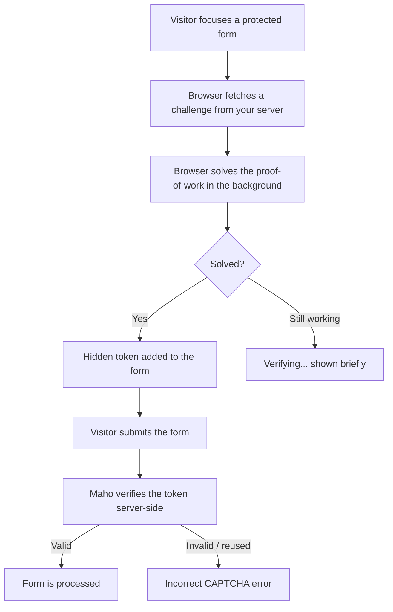

# Captcha <span class="version-badge">v25.3+</span>

Maho ships a built-in, self-hosted captcha that protects your storefront and admin forms from automated abuse without sending any of your visitors' data to a third party. It is powered by the open-source [Altcha](https://altcha.org) project and runs entirely on your own server.

!!! info "Why this matters"
    Most captcha services (reCAPTCHA, hCaptcha and friends) are hosted by third parties that profile your customers and set tracking cookies, which is a GDPR headache for European stores. Maho's captcha is **self-hosted, cookieless, and GDPR-compliant**: there are no external API calls and no third-party scripts. Maho was the first e-commerce platform to ship a solution like this out of the box.

!!! tip "Invisible to real customers"
    This is a **proof-of-work** captcha, not an image-puzzle. There are no traffic lights to click and no distorted text to read. The visitor's browser quietly solves a small computational challenge in the background, so legitimate customers usually never notice it is there.

## How it works

Instead of asking the human to prove they are human, Altcha asks the **browser** to do a tiny bit of throwaway work (a proof-of-work computation) before the form can be submitted. This work is trivial for a single genuine visitor but becomes expensive for a bot trying to hammer your forms thousands of times.



Everything happens on your server: the challenge is generated and verified locally, signed with your store's encryption key, and a solved token cannot be reused (replay protection), so the same proof cannot be submitted twice.

## What it protects

Out of the box, the captcha guards the most-abused forms in a typical store:

**Storefront**

- One-page checkout (billing step)
- Contact form
- Customer registration
- Forgot password
- Newsletter subscription
- Product reviews (on the product page and the review list page)
- Wishlist sharing
- EU revocation form

**Admin**

- Admin login
- Admin forgot password

The admin login and forgot-password forms are always covered by the captcha when it is enabled, which is a meaningful brute-force defence for your store's back office.

## Enabling and configuring

You will find the settings under **System → Configuration → Advanced → Admin → Captcha**.

| Setting | What it does |
|---------|--------------|
| **Enable Captcha** | The master on/off switch. When off, no captcha is rendered or checked anywhere. |
| **CSS Selectors** | The list of storefront forms the captcha is applied to, one CSS selector per line. |

The settings can be configured per **website** and **store view**, so you can enable the captcha for some stores and not others.

### Customising which forms are protected

The **CSS Selectors** field controls exactly which storefront forms get the captcha. Each line is a CSS selector that targets a form on a specific page. The default list looks like this:

```
.checkout-onepage-index #co-billing-form
.contacts-index-index #contactForm
.customer-account-login #form-validate-register
.customer-account-login #form-validate-forgot
#newsletter-validate-detail
.catalog-product-view #review-form
.review-product-list #review-form
.wishlist-index-share #form-validate
.revocation-index-index #revocation-form
```

- **One selector per line.**
- To **disable** a line without deleting it, prefix it with `//`:

  ```
  // .contacts-index-index #contactForm
  ```

- To **protect a custom form** (for example one added by an extension), add its own CSS selector on a new line. The first part usually scopes it to a page (the `<body>` class for that route) and the second part targets the form element.

!!! note "The admin login form is always covered"
    The CSS Selectors field only affects **storefront** forms. The admin login and forgot-password forms are handled automatically whenever the captcha is enabled, so you do not need to list them.

## What your visitors see

When a visitor interacts with a protected form, a small Altcha widget appears (by default floating in the bottom-right corner) and shows a brief "Verifying..." state while the browser solves the challenge. For the overwhelming majority of real visitors this completes in a moment and the form submits as normal.

If verification fails or a token is reused, the visitor sees an **"Incorrect CAPTCHA."** message and can simply try again.

## Privacy and compliance

- **No third-party calls.** The challenge is generated and verified on your own server.
- **No cookies and no tracking.** Nothing about your visitors is shared externally.
- **GDPR-friendly by design**, which makes it especially well-suited to European stores where third-party captchas raise data-protection concerns.

!!! tip "Pair it with the built-in honeypot and rate limiting"
    The captcha is one layer of Maho's abuse protection. Several forms (such as the contact and revocation forms) also use invisible honeypot fields and rate limiting. For developers building custom forms, see the [Rate limiting & honeypot](../developer/rate-limiting-honeypot.md) developer guide.
