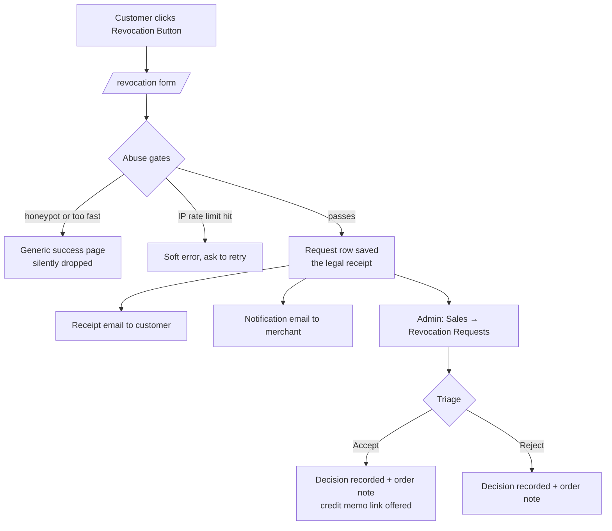

# Revocation Button v26.7+

The `Maho_Revocation` module provides the mandatory online revocation (withdrawal) button that EU consumer law requires B2C shops to offer. It gives customers a permanently reachable form to declare withdrawal from their contract, gives merchants a clean admin workflow to triage and process those declarations, and keeps a tamper-proof legal receipt of every submission.

!!! info "Why this exists"
    **EU Directive 2023/2673** amends the Consumer Rights Directive and requires online shops selling to EU consumers to provide a clearly labelled **revocation button** that lets a customer withdraw from a distance contract with a few clicks. In Germany this is transposed as **§356a BGB**. The obligation applies **from 19 June 2026**. This module is Maho's built-in answer to that requirement.

!!! warning "Not legal advice"
    Maho ships this as a tool to help you comply, it is not legal advice. Confirm the exact wording, placement, and process with your own counsel for the markets you sell into.

!!! tip "Try it in the live demo"
    The revocation button is enabled on our [live demo](../about/demo.md). The public storefront form is at [demo.mahocommerce.com/revocation/](https://demo.mahocommerce.com/revocation/), and you can see the matching admin workflow under **Sales → Revocation Requests** in the [demo admin panel](../about/demo.md).

## Overview

The module adds a self-contained revocation channel to your store:

- **Public revocation form** at `/revocation`, reachable without login, as the law requires.
- **A placeable button widget** so the link stays permanently visible (typically in the footer) during the withdrawal period.
- **A my-account shortcut** on the customer's order page that pre-fills the form for that order.
- **An immutable legal receipt** written to the database for every submission, even when emails fail.
- **Automatic emails**: a receipt acknowledgement to the customer and a notification to the merchant.
- **A full admin workflow** under **Sales → Revocation Requests**: grid, detail view, accept/reject, order linking, CSV export, and mass actions.
- **Invisible abuse protection**: honeypot, submit-timing gate, and rate limits, with no manual CAPTCHA or email-verification step (both are legally inadmissible for this form).

## Key Benefits

### For Compliance
- **Meets the Directive 2023/2673 / §356a BGB button obligation** with a one-click, always-reachable form.
- **No login wall**: the public form is accessible to anyone, as the law requires.
- **No inadmissible friction**: no manual CAPTCHA, no email confirmation link, no mandatory account, so a valid declaration is never blocked.
- **Audit-ready receipts**: every declaration is stored with timestamp (UTC), IP, user agent, and locale, and is never edited after insert.

### For Merchants
- **Single triage queue** with search, filters, and CSV export.
- **One-click accept/reject**; once accepted, the request view offers a direct link into the standard credit memo flow for the refund.
- **Order linking** so a declaration ties back to the real order, with order history comments for the audit trail.
- **Spam-resistant** by default without harming legitimate customers.

### For Customers
- **Simple, accessible form**: name, email, order number, and an optional reason.
- **Pre-filled from their account** when they start from their order page.
- **Immediate confirmation** that their declaration was received.

## How It Works

The **request row is the legal receipt**: it is written first and nothing after it (email sending, order history) can abort the flow. If a receipt email is suppressed or fails, the declaration still stands and remains visible and resendable in the admin.

## Setup

Enabling the module alone does **not** make the button appear. There are two required steps.

### 1. Enable and configure

The module ships **disabled by default**: the obligation only applies to B2C shops selling into the EU, so stores that don't need it aren't burdened with a feature they'd have to turn off.

Go to **System → Configuration → Sales → Revocation Button** and set **Enabled** to *Yes*. See [Configuration](#configuration) below for the rest of the settings.

Once enabled, the form lives at `/revocation`, but nothing links to it yet.

### 2. Place the button widget

The law requires the revocation button to stay **permanently visible** during the withdrawal period, and only your theme knows where that belongs (usually the footer). Add the **Revocation Button** widget to a block shown on every storefront page:

1. Go to **CMS → Widgets → Add New Widget**.
2. Choose type **Revocation Button** and your theme.
3. Add a **Layout Update** with a display location shown site-wide (for example, *All Pages* targeting your footer container, or a footer static block reference).
4. Optionally set a **Custom Label**; leave it empty to use the label configured in the section settings.

!!! warning "Until you place the widget, customers cannot reach the form"
    Enabling the module creates the form at `/revocation` but does not display any link to it. The widget (or a manual link you add) is what makes it discoverable, which is what the law actually requires.

The widget renders a single `<a class="revocation-button">` link, so the surrounding markup and styling stay entirely under your theme's control.

### My-account shortcut

When the module is enabled, a **"Revoke this contract"** link automatically appears on the customer's order view page (My Account → Orders → order detail), as long as the order is still within the configured cooling-off window. This link pre-fills the form with the order's data and marks the resulting request as **verified** (see [Verified vs unverified](#verified-vs-unverified-requests)).

## Configuration

All settings live under **System → Configuration → Sales → Revocation Button**.

### General

| Setting | Description | Scope | Default |
|---------|-------------|-------|---------|
| **Enabled** | Master switch. Does not by itself display the button, you must place the widget. | Store View | No |
| **Button Label** | Text for the storefront button. Leave empty for the translated default ("Revoke contract" / "Vertrag widerrufen"). | Store View | (empty) |
| **Merchant Notification Email** | Where merchant notifications are sent. Leave empty to use the General Contact email. | Store View | (empty) |
| **Cooling-Off Period (Days)** | Gates the my-account shortcut only, never the public form. The statutory period is 14 days. | Store View | 14 |

The cooling-off window is measured from the latest shipment date when available, falling back to the order date. Setting it to `0` always shows the my-account link. It never restricts the public `/revocation` form, which must remain open.

### Email Settings

| Setting | Description | Scope |
|---------|-------------|-------|
| **Email Sender** | Store email identity used as the sender. | Store View |
| **Customer Receipt Template** | Acknowledges **receipt** of the declaration only, never acceptance. | Store View |
| **Merchant Notification Template** | Template sent to the merchant for each new request. | Store View |

!!! danger "Receipt wording is legally sensitive"
    The customer receipt email must confirm only that the **declaration was received**. It must **never** state or imply that the revocation has been **accepted**. Acceptance is a separate decision the merchant makes later in the admin. Keep this distinction if you customize the template.

The merchant notification sets the customer's address as **Reply-To** so you can respond directly. On the public path that address is unverified but always validated for format (no header-injection risk).

### Abuse Protection

This form must stay frictionless, so only **invisible** background measures are used. Manual CAPTCHAs and email verification links are legally inadmissible for the revocation form.

| Setting | Description | Default |
|---------|-------------|---------|
| **Minimum Submit Time (Seconds)** | Submissions faster than this after the page renders are silently dropped as bots. `0` disables. | 3 |
| **Submissions per IP per Hour** | Hard limit per IP; over-limit submissions are refused. `0` disables. | 5 |
| **Receipt Emails per Recipient per Day** | Over this, the request is still recorded but the **customer receipt email** is suppressed (resendable in admin). Defeats email-bombing of third parties. `0` disables. | 1 |
| **Merchant Notifications per Store per Hour** | Throttles merchant notification emails. `0` disables. | 100 |

!!! tip "Do not over-tighten these"
    These gates exist to stop bots and abuse, not real customers. Setting them too strictly can block legitimate declarations, which defeats the legal purpose of the button. The defaults are conservative on purpose.

**How the gates behave:**

- **Honeypot**: a hidden field humans never see. Bots that fill it get the *normal success page* so they receive no signal that a trap exists. No row is written, no email is sent.
- **Submit timing**: the form embeds an encrypted render timestamp; a submit faster than the minimum is treated as a bot and silently dropped (also shown the normal success page). Under full page cache a stale token only ever inflates the measured time, so the gate "degrades open" and never blocks a real user.
- **IP rate limit**: over-limit submissions are refused with a soft error asking the customer to retry later or contact you directly.
- **Recipient rate limit**: protects a victimized third party from email-bombing. The declaration is still recorded and the merchant is still notified; only the courtesy email to that address is withheld, and an admin can resend it.

Rate limits are rolling-window counters kept on the cache backend. They are a soft throttle for abuse mitigation, not a hard atomic guarantee.

## Admin Workflow

Open **Sales → Revocation Requests** to manage incoming declarations. Two ACL permissions control access:

- **View Requests** (`sales/revocation/view`) for read access.
- **Process Requests** (`sales/revocation/process`) for saving notes, accepting/rejecting, linking orders, resending, and mass actions.

### The grid

The grid lists every request with ID, received timestamp, store view, verified flag, customer name, email, order reference, matched order (linked when resolved), email-suppressed timestamp, processed status, and processed-at timestamp. It supports filtering, sorting, **CSV export**, and **mass actions** to mark selected requests Accepted or Rejected.

<figure markdown="span">

<figcaption>The revocation queue under Sales > Revocation Requests</figcaption>
</figure>

!!! note "Mass actions mark requests only"
    Bulk Accept/Reject updates the request rows but does **not** change the matched orders. Order-level actions (status note, refund) are applied one at a time from the detail view, where you can see the matched order.

### The detail view

From a single request you can:

- **Save an internal note**, without touching the order or the request's status.
- **Accept or Reject** the revocation. This records the decision on the request and adds an audit comment to the matched order's history; it does **not** change the order's status, state, or issue any refund. After you accept, if the order can still be credit-memoed, the view shows a link to **create a credit memo** through Maho's standard refund flow.
- **Link an order** manually after triage when the automatic match did not resolve (by entering the order increment ID).
- **Resend the receipt email**, which also clears a rate-limit suppression and records the resend in the note log.

!!! note "The revocation outcome lives on the request, not the order status"
    Accepting or rejecting never overrides the order's state/status. A revocation can target an order in any state, and the refund (when accepted) goes through the standard credit memo flow. The order only receives a history comment for the audit trail.

### Verified vs unverified requests

Each request carries a **verified** flag:

- **Verified (Yes)**: submitted by a logged-in customer via the "Revoke this contract" link on **their own** order page. Order ownership is re-checked server-side. These are automatically linked to the order, and an order history comment is added.
- **Unverified (No)**: every public-form submission, even when the order reference, name, and email all match an existing order. On the public path, a full match links the request to the order for your convenience, but it stays unverified. An unverified self-assertion must never elevate itself, because a verified, linked request is what lets you safely apply order-level changes.

## Data Stored

Every submission is written to the `revocation_request` table. Key fields:

| Field | Purpose |
|-------|---------|
| `received_at` | Submission timestamp in UTC, captured before any abuse gate. |
| `order_reference` | The order number exactly as the customer typed it. |
| `order_id` | The matched order, when resolved (or linked later in admin). |
| `customer_name`, `email`, `reason` | The declaration content (reason is optional). |
| `verified` | 1 only for authenticated my-account submissions. |
| `ip`, `user_agent`, `locale` | Context captured for the audit record. |
| `processed_status`, `processed_at`, `admin_note` | The merchant's triage decisions and notes. |
| `suppressed_at`, `suppressed_reason` | Set when a receipt email was withheld (e.g. rate limit). |

Declaration fields are never edited after insert, the row is the legal receipt.

## Customization

- **Form fields and layout**: override `revocation/form.phtml` in your theme.
- **Button markup/styling**: override `revocation/button.phtml`; the default renders a bare `<a class="revocation-button">`.
- **Emails**: copy the `revocation_received` and `revocation_merchant_notification` templates in **System → Transactional Emails** and select them in the section settings. Keep the receipt-vs-acceptance distinction.
- **Translations**: strings live in `app/locale/en_US/Maho_Revocation.csv`. The module ships in English; every string is translatable, so you can supply the German §356a wording ("Vertrag widerrufen") or any other locale through a language pack.

## Frequently Asked Questions

**Do I have to use this module to comply?**
No, but you must provide a compliant revocation button somehow. This module is Maho's built-in implementation. As always, confirm your obligations with legal counsel.

**Why isn't the button showing after I enabled the module?**
Enabling only creates the form at `/revocation`. You must place the **Revocation Button** widget on a site-wide block (usually the footer) for it to appear. See [Setup](#setup).

**Can a customer file a revocation without an account?**
Yes. The public form requires no login, which is what the law mandates. Logged-in customers get a pre-filled, verified shortcut as a convenience.

**A customer says they submitted but got no email. Did it fail?**
Check the grid. If the row exists, the declaration is legally received regardless of email delivery. If **Email Suppressed** is set (e.g. recipient rate limit), open the request and use **Resend** to send the receipt.

**Does accepting a revocation refund the customer automatically?**
No. Accepting records the decision and adds a note to the order; it changes no order status or state. When the order can still be credit-memoed, the request view shows a link to create a credit memo, so you complete the refund through Maho's standard flow and stay in control of the money movement.
